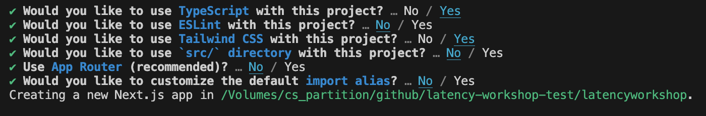
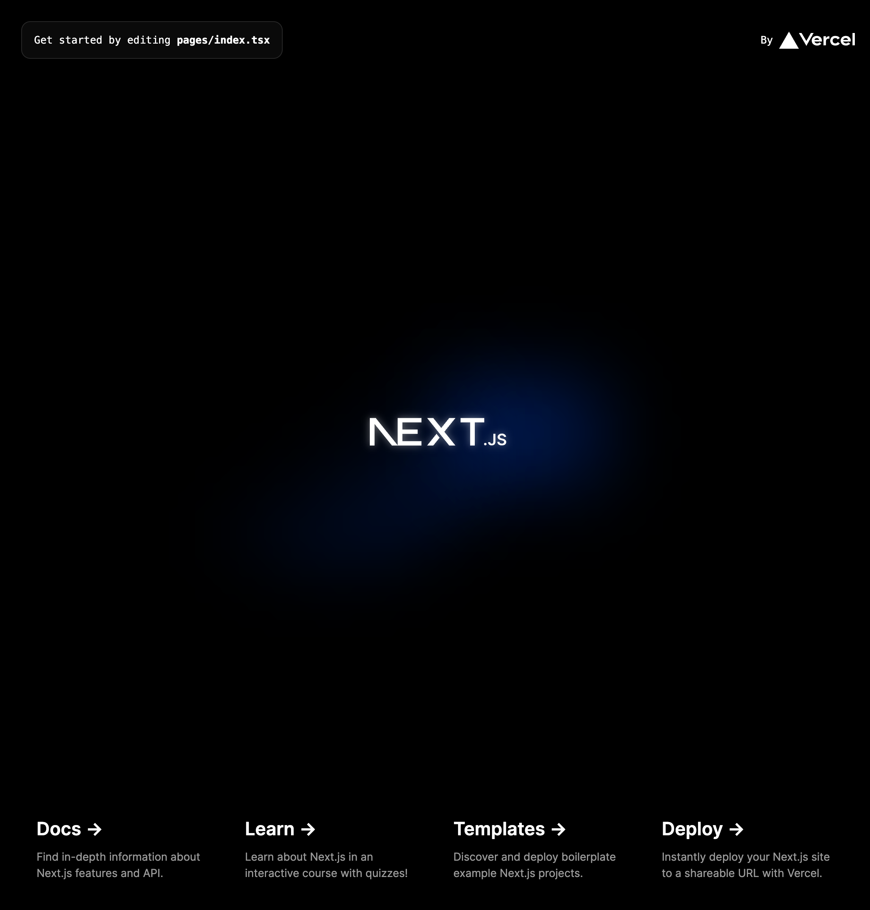
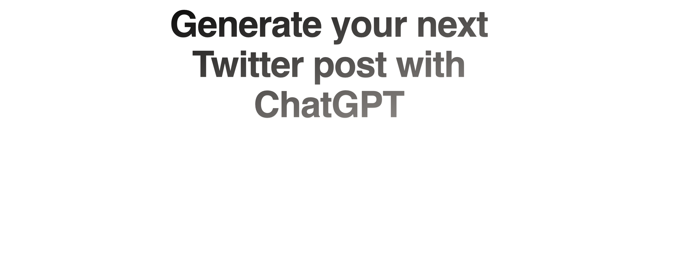
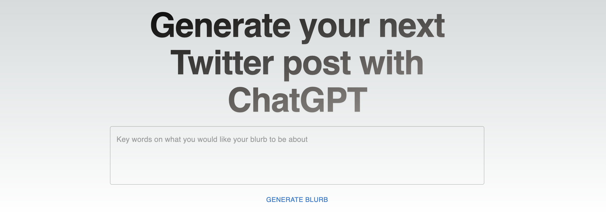
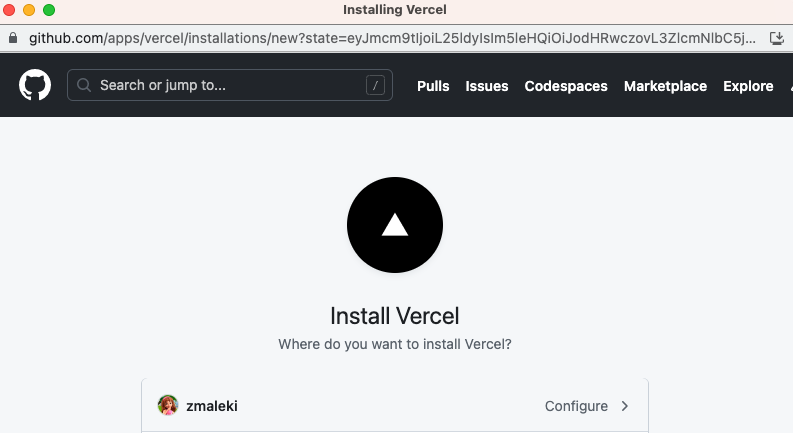
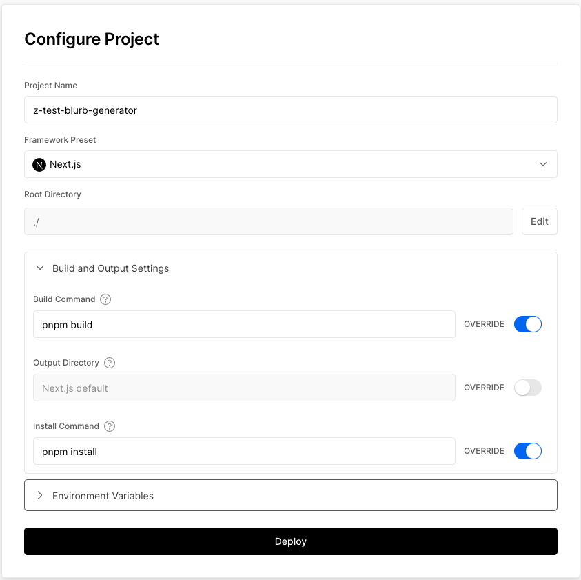
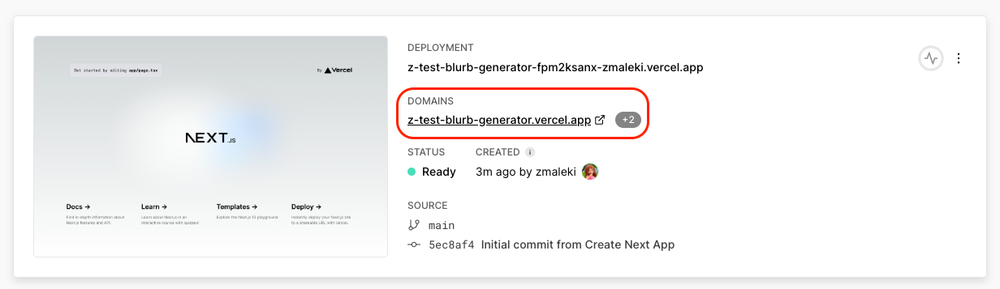

# Module 1

In this module you will be learning about some of the web development technologies that we are most excited about. You will go through the basic concepts, understanding the technologies we are using in this workshop and why, we will then take you through how to get started in building your first hello world application and how to deploy and get it running.

## Basic concepts

Let's begin with some of the basic concepts about tools and technologies we are using in this workshop:

### What is Next.js?

Next.js is a popular React framework that provides built-in [server-side rendering (SSR)](https://nextjs.org/learn/foundations/how-nextjs-works/rendering) capabilities. It combines the power of server-side rendering, static site generation, and client-side rendering, offering a versatile framework for building performant and scalable web applications. Its simplicity, performance optimizations, and robust feature set make it a compelling choice for developers and organizations seeking to build modern web applications.

### What is pnpm and why are we using it?

Pnpm is a new nodejs package manager like npm and yarn. It stands out as an excellent package manager known for its remarkable speed, surpassing both yarn and npm in terms of performance. When using pnpm, you can truly experience its swift package installation process. Additionally, an advantageous aspect of pnpm is its compatibility with different versions of Node.js, resembling the convenience of nvm for managing nodejs versions. Following steps will take you through how to install Next.js with pnpm:

## Creating hello world app in Next.js

```bash
npm install -g pnpm
```

Create an app

``` bash
pnpm create next-app latency-workshop-app --template typescript --use-pnpm
```
The --use-pnpm flag ensures that pnpm is used as the package manager for the project. Make sure to follow the config as below:



Navigate to the app directory: Once the project is created, navigate to the app's directory using the following command:

```bash
cd latency-workshop-app
```

Start the development server: Now, you can start the development server and run your Next.js app. Use the following command:

```bash
pnpm dev
```

This command will start the development server and provide you with a local URL (e.g., http://localhost:3000) where you can view your app.

<!--  -->

That's it! You've successfully created a new Next.js app using pnpm as the package manager. You can start building your app by modifying the files in the pages directory and exploring the Next.js documentation for more information on how to work with Next.js features and components.

## Creating your homepage

Once you created a hello world app, it's time to create your home page and add new components. Before we add components, let's setup a design library that offers a wide range of prebuilt components so we could save a lot of time spent on designing responsive UI elements.

For this workshop we have decided to use [Material UI](https://mui.com/material-ui/react-typography/) library. To integrate material UI into your app, run below command

```bash
pnpm install @mui/material @emotion/react @emotion/styled
```

Now let's go to pages/index.ts and replace everything with the following. Execute ```pnpm dev``` to check your latest changes

```typescript
import { Typography } from "@mui/material";

export default function Home() {
  return (
    <Typography variant="h1">
      Generate your next Twitter post with ChatGPT
    </Typography>
  );
}
```

Obviously this doesn't look great, so lets add in some simple tailwind to make it look a bit nicer. Feel free to play around with it to get to look as you would like. [Tailwind](https://tailwindcss.com/) is a CSS library that comes with the app if you selected yes on tailwind setup when you were creating your Next.js app.

```diff
import { Typography } from "@mui/material";

export default function Home() {
  return (
    <Typography
      variant="h1"
+      className="bg-gradient-to-br from-black to-stone-400 bg-clip-text text-center font-display text-4xl font-bold tracking-[-0.02em] text-transparent drop-shadow-sm md:text-7xl md:leading-[5rem]"
    >
      Generate your next Twitter post with ChatGPT
    </Typography>
  );
}
```

This still is not looking quite right. So lets wrap this in a Stack to get it centred as we would like. 

```diff 
- import { Typography } from "@mui/material";
+ import { Typography, Stack } from "@mui/material";

export default function Home() {
  return (
+   <Stack
+     component="main"
+     direction="column"
+     maxWidth="50em"
+     mx="auto"
+     alignItems="center"
+     justifyContent="center"
+     py="1em"
+     spacing="1em"
+   >
      <Typography
        variant="h1"
        className="bg-gradient-to-br from-black to-stone-400 bg-clip-text text-center font-display text-4xl font-bold tracking-[-0.02em] text-transparent drop-shadow-sm md:text-7xl md:leading-[5rem]"
      >
        Generate your next Twitter post with ChatGPT
      </Typography>
+   </Stack>
  );
}
```

Let’s quickly go over what we have done. Your homepage should look like the below:


Next step is to add a textbox so people can type what blurb they would like to generate:

```diff
- import { Typography, Stack } from "@mui/material";
+ import { Stack, TextField, Typography } from "@mui/material";

export default function Home() {
  return (
    <Stack
      component="main"
      direction="column"
      maxWidth="50em"
      mx="auto"
      alignItems="center"
      justifyContent="center"
      py="1em"
      spacing="1em"
    >
      <Typography
        variant="h1"
        className="bg-gradient-to-br from-black to-stone-400 bg-clip-text text-center font-display text-4xl font-bold tracking-[-0.02em] text-transparent drop-shadow-sm md:text-7xl md:leading-[5rem]"
      >
        Generate your next Twitter post with ChatGPT
      </Typography>

+     <TextField
+       multiline
+       fullWidth
+       minRows={4}
+       sx={{ "& textarea": { boxShadow: "none !important" } }}
+       placeholder="Key words on what you would like your blurb to be about"
+     ></TextField>
    </Stack>
  );
}
```

Let's now add a button that allows users to generate their blurb and have an empty function that is called when the button is clicked:

```diff
import { Button, Stack, TextField, Typography } from "@mui/material";

export default function Home() {
  function generateBlurb(): void {
    throw new Error("Function not implemented.");
  }

  return (
    <Stack
      component="main"
      direction="column"
      maxWidth="50em"
      mx="auto"
      alignItems="center"
      justifyContent="center"
      py="1em"
      spacing="1em"
    >
      <Typography
        variant="h1"
        className="bg-gradient-to-br from-black to-stone-400 bg-clip-text text-center font-display text-4xl font-bold tracking-[-0.02em] text-transparent drop-shadow-sm md:text-7xl md:leading-[5rem]"
      >
        Generate your next Twitter post with ChatGPT
      </Typography>

      <TextField
        multiline
        fullWidth
        minRows={4}
        sx={{ "& textarea": { boxShadow: "none !important" } }}
        placeholder="Key words on what you would like your blurb to be about"
      ></TextField>

+     <Button onClick={generateBlurb}>Generate Blurb</Button>
    </Stack>
  );
}
```

Congratulations! Your homepage is now completed. It should look like below:



In this workshop we are not focusing on learning about UI designs, if you are interested to learn more about [Tailwind](https://tailwindcss.com/) and [Material UI](https://mui.com/material-ui/getting-started/overview/) on your own time, feel free so.

## Deploying your application into production

The last part of this module is to deploy your application into production. In this workshop we want you to learn how to create an app from the beginning and how to deploy it end to end to have it all running in production.

### Setting up your git repository

Before we get to the deployment, you will have to first push your application into a git repository. This is required for setting up automatic deployment from every change you push into your main branch (Continuous Deployment).

**Step1:**
Go to your GitHub account and create a new repository. Take a note of your repository clone url

> **Note**
> Make sure to create the new repository under your personal profile not your work organization to avoid permission problems later.

**Step 2:**
Go back to the terminal in your Visual Studio Code. Make sure you currently are in the app folder that you just created.

Execute the following commands:

```bash
git init
git branch -M main
git remote add origin '[your repository clone url]'
git push -u origin main
```

### Deploying your webapp using Vercel

Now that we have our hello world application we would like to learn how to deploy this app into production. To do that, we are using Vercel for deploying server infrastructure.

#### What is Vercel?

Vercel is a cloud platform that specializes in static site hosting and serverless functions deployment. It provides an intuitive and seamless way to deploy web applications, APIs, and serverless functions, with a focus on speed, scalability, and ease of use. Vercel is known for its developer-friendly experience, making it a popular choice for static site hosting, Jamstack applications, and serverless functions deployment. It offers an intuitive user interface, seamless Git integration, automatic scaling, built-in analytics and monitoring, domain and SSL management and a range of powerful features that simplify the deployment and management of modern web applications.

If you wanted to deploy this application using AWS services, you would have had to learn about infrastructure such as CloudFront, API Gateway, Lambda, Route 53, SSL management, S3 buckets and tools to deploy and manage your infrastructure such as CDK. Vercel abstracts all of those complexities away allowing you to focus on application development rather than managing infrastructure. This brings an incredible speed when you want to get started with building your product idea as well as it eliminating all the costs of maintaining your infrastructure going forward.

### Setting Up Vercel

1. Go to https://vercel.com/
2. Click on the `Sign Up` button
3. Select `Hobby`. Enter your name. Click Continue
4. Click `Continue with GitHub`
5. Authorize Vercel to connect to your GitHub account <br/>
  Make sure to configure the permissions correctly

6. Click `Import` next to your Git repository
7. Click on the `Build and Output Settings` accordion.
8. Under `Build Command`, enable the override toggle and enter `pnpm build`
9. Under `Install Command`, enable the override toggle and enter `pnpm install`

11. Click `Deploy`
12. Once the application has been deployed, click on the image below `Continue to Dashboard` to view your deployed application<br/>


Congratulations you have now completed Module1 and ready to move on to the second module. Your completed app should look like this: [Module1-final demo](final-demo/latency-workshop-app/). <br/>
If you have any issues finishing off module1, you can download the content in ```final-demo/latency-workshop-app``` and move onto the next module.
