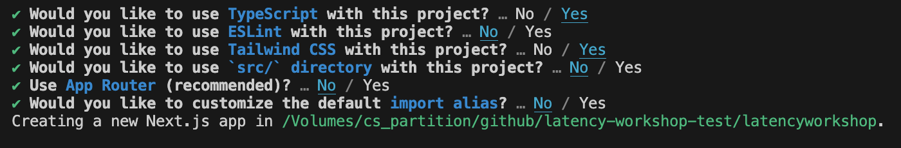
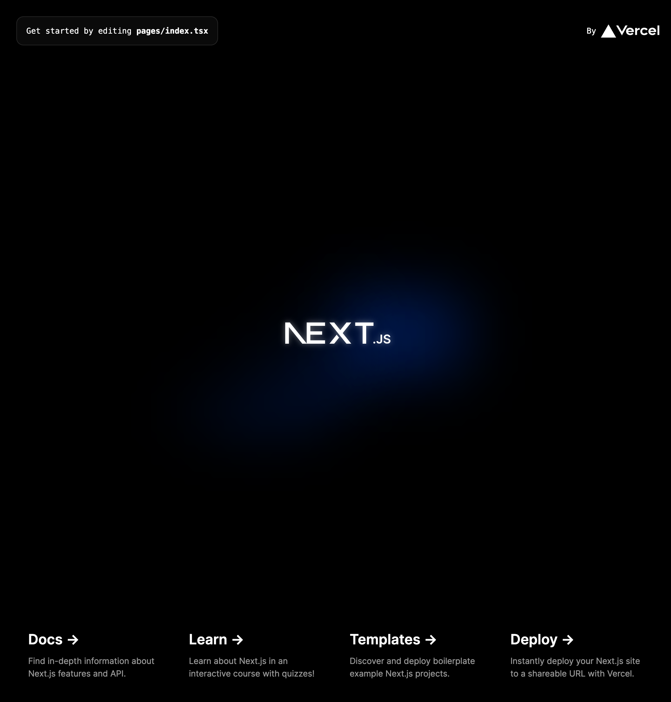

# Module 2

# Context 


## What is OpenAi, and how do I use it


## What is NextJS
A great advangate of using Next.js is being able to handle both the frontend and backend in a single app. We can then spinup the apiroute generate, by creating a file called genreate.ts in our apu folder.

Lets see what this is doing.

We are taking a prompt from the request body, passed in fdrom, the frontend. We then construct a payload to OpenAI. In this payload we soecufut the exact model and how many token we want returtned. In this case we are limiting this because twitter posts have a max chacarter constraint.

After the payload is constructed, we send it in a POST request to OpenAI, await the result to get back the generated bios, then send them back to the client as JSON.


### Lets get started with the frontend!

Opening up our terminal lets create a new nextJS app

```pnpm create next-app latency-workshop-app --template typescript```

and create with the following options

Now lets check everything is working, run  ```cd latency-workshop-app && pnpm run dev``` and check that the nextJs template is running.






Now we can get started on our app!

Lets build out the components we are going to need first. We are going to work from the top down of the page


1. run ```pnpm install @mui/material @emotion/react @emotion/styled```
2. Goto pages/index.ts and replace all with the following

```
import { Stack, Typography } from "@mui/material";

export default function Home() {
  return (
    <Typography variant="h1">
      Generate your next Twitter post with ChatGPT
    </Typography>
  );
}
```

Obviously this dosnt look too great, so lets add in some simple tailwind to make it look a bit nicer. Feel free to play around with it to get to look as you would like.

```
    <Typography
      variant="h1"
      className="bg-gradient-to-br from-black to-stone-400 bg-clip-text text-center font-display text-4xl font-bold tracking-[-0.02em] text-transparent drop-shadow-sm md:text-7xl md:leading-[5rem]"
    >
```


This still isnt looking quite write. So lets wrap this in a Stack to get it centred as we would like. 

```
    <Stack
      component="main"
      direction="column"
      maxWidth="50em"
      mx="auto"
      alignItems="center"
      justifyContent="center"
      py="1em"
      spacing="1em"
    >
      <Typography
        variant="h1"
        className="bg-gradient-to-br from-black to-stone-400 bg-clip-text text-center font-display text-4xl font-bold tracking-[-0.02em] text-transparent drop-shadow-sm md:text-7xl md:leading-[5rem]"
      >
        Generate your next Twitter post with ChatGPT
      </Typography>
    </Stack>
```
Let’s quickly go over what we are doing here.


Should look like the below


3. Lets add in our intial prompt, first lets create a new folder ```components/fields/PostTextArea.ts```. 

We're gonna set it up as below:

INSERT LE IMAGE

Lets get started by creating this file 

```
import { Box, TextField, Typography } from "@mui/material";
import { MutableRefObject } from "react";

interface Props {
  bioRef: MutableRefObject<string>;
}

export function PostTextArea({ bioRef }: Props) {
  return (
    <Box>
      <Typography variant="body1">
        What content do you want your post to be about?
      </Typography>

      <TextField
        multiline
        fullWidth
        minRows={4}
        sx={{ "& textarea": { boxShadow: "none !important" } }}
        placeholder="e.g. I'm learning about NextJs and OpenAI GPT-3 api at the Latency Conference."
        onChange={(e) => {
          bioRef.current = e.target.value;
        }}
      />
    </Box>
  );
}
```


Let’s quickly go over what we are doing here.

- We are creating a new textfield using the MUI library.
- Applying specific styling to remove box shadow
- Placing placeholder htext
- Pass in the prop {{bioRef}}


Next Step is to create our ChatGPTForm. This is where we will populate our textboxt and the rest of our input components.

Create ```components/forms/ChatGptForm.ts```

```

import { Stack } from "@mui/material";
import { useRef } from "react";
import { PostTextArea } from "../fields/PostTextArea";

interface Props {
  blurbsGenerated: boolean;
  setBlurbsGenerated: (blurbsGenerated: boolean) => void;
}
export function ChatGPTForm({ blurbsGenerated, setBlurbsGenerated }: Props) {
  const bioRef = useRef("");
  return (
    <Stack direction="column" spacing="1em" width="100%">
      <PostTextArea bioRef={bioRef} />
    </Stack>
  );
}
```

Let’s quickly go over what we are doing here.

- Importing our PostTextArea component that we just created
- Placing our component in a stack, and passing in the bioref prop


Now lets go to our index file, and make the following changes.


```
...
<ChatGPTForm
  blurbsGenerated={blurbsGenerated}
  setBlurbsGenerated={setBlurbsGenerated}
/>
...
```

Challenge: Can you set the width of the new component?

### Adding a Dropdown Component.

What are we going to be doing:
- Creating a Generic Dropdown Component
- Creating a Vibe Component
- Then you'll go off and create your own component.

#### Generic Dropdown component

Create ```components/fields/DropDown.tsx```, and throw this code in their

```
import { Box, FormControl, MenuItem, Select, Typography } from "@mui/material";

interface Props<T> {
  value: T;
  label: string;
  options: string[];
  setState: (value: T) => void;
}

export default function DropDown<T>({ value, label, options, setState }: Props<T>) {
  return (
    <Box>
      <Typography variant="body1">{label}</Typography>
      <FormControl fullWidth hiddenLabel>
        <Select
          notched={false}
          value={value}
          onChange={(e) => setState(e.target.value as T)}
        >
          {options.map((option) => (
            <MenuItem key={option} value={option}>{option}</MenuItem>
          ))}
        </Select>
      </FormControl>
    </Box>
  );
}
```

Let’s quickly go over what we are doing here:

- This is a TypeScript React component that renders a dropdown menu with a label and a list of options.

- It takes in four props: value, label, options, and setState.

- It uses Material-UI components for its UI.

- The value prop is the currently selected option in the dropdown.

- The label prop is the text that appears above the dropdown.

- The options prop is an array of strings that represent the available options in the dropdown.

- The setState prop is a function that updates the state of the parent component when a new option is selected.

- The component renders a Box component that contains a Typography component with the label prop as its text.

- Below that is a FormControl component that wraps a Select component.

- The Select component has the value prop set to the current value prop and an onChange event handler that calls the setState function with the new selected value.

- The options prop is mapped over to create a list of MenuItem components, each with a unique key prop and a value prop set to the corresponding option string.


Now, lets create a Vive Components ```latencyworkshop/components/fields/VibeDropDown.tsx```

Feel free to change up the names of the vibes, and add your own.

```
import DropDown from "./DropDown";

export type Vibe = "Professional" | "Casual" | "Funny";
export const vibes: Vibe[] = ["Professional", "Casual", "Funny"];

interface Props {
  vibe: Vibe;
  setVibe: (vibe: Vibe) => void;
}

export function VibeDropDown({ vibe, setVibe }: Props) {
  return (
    <DropDown
      value={vibe}
      setState={setVibe}
      label="Select your vibe"
      options={vibes}
    />
  );
}

```
Lets explain what we are doing here:
- Create a typescript type for our vibe
- Create a list of vibes of type Vibe
- Create a Props interface that takes in a vibe and setVibe function
- Create a VibeDropDown component that takes in the vibe and setVibe props

Great, lets add that into our ChatGPTForm component

```
// import "react-circular-progressbar/dist/styles.css";

import { Stack } from "@mui/material";
import { useRef, useState } from "react";

import { PostTextArea } from "../fields/PostTextArea";
import { Vibe, VibeDropDown } from "../fields/VibeDropDown";

interface Props {
  blurbsGenerated: boolean;
  setBlurbsGenerated: (blurbsGenerated: boolean) => void;
}
export function ChatGPTForm({ blurbsGenerated, setBlurbsGenerated }: Props) {
  const bioRef = useRef("");
  const [vibe, setVibe] = useState<Vibe>("Professional");

  return (
    <Stack direction="column" spacing="1em" width="100%">
      <Stack
        spacing="1em"
        width="100%"
        maxWidth="48em"
        mx="auto"
        alignItems="center"
      >
        <PostTextArea bioRef={bioRef} />
        <VibeDropDown vibe={vibe} setVibe={(newVibe) => setVibe(newVibe)} />
      </Stack>
    </Stack>
  );
}
```

### Add your own dropdown component!

front end confuses me

GenerateBio.tsx
```
const generateBio = async (e: any) => {
  e.preventDefault();
  setGeneratedBios("");
  setLoading(true);

  const response = await fetch("/api/generate", {
    method: "POST",
    headers: {
      "Content-Type": "application/json",
    },
    body: JSON.stringify({
      prompt,
    }),
  });

  if (!response.ok) {
    throw new Error(response.statusText);
  }

  let answer = await response.json();
  setGeneratedBios(answer.choices[0].text);
  setLoading(false);
};
```

## Backend 


A great advantage of using NEtJs is that we can handle both the frontend and backend in a single application. We can easily spin up a new ap route by creating a file ```pages/api/generate.ts```

We get the prompt from the request body that is passed in from the frontend. In this payload we have to specifiy the api paramters needed by gpt3.5.

After the payload is constructed, we seend it in a POST request to OpenAI, await the result to get back the generated bios, then we send that back to the client as JSON


generate.ts

```
export default async function handler(req, res) {
  const { prompt } = req.body;

  const payload = {
    model: "gpt-3.5-turbo",
    messages: [{ role: "user", content: prompt }],
    temperature: 0.7,
    top_p: 1,
    frequency_penalty: 0,
    presence_penalty: 0,
    max_tokens: 200,
    n: 1,
  };

  const response = await fetch("https://api.openai.com/v1/chat/completions", {
    headers: {
      "Content-Type": "application/json",
      Authorization: `Bearer ${process.env.OPENAI_API_KEY ?? ""}`,
    },
    method: "POST",
    body: JSON.stringify(payload),
  });

  const json = await response.json();
  res.status(200).json(json);
}
```

Thats it! we've built the first version of our application. 

Whilst this appraach works, there are limitations to a serverless function.

1. If we are building a app that we want to wait for longer responses, this will likley take longer than 10 seconds which can lead to a timeout issue on the vercel free tier.

2. Waiting several seconds before seeing any data is poor UX design. Ideally we want to have a incremental load to do this.

3. Cold start times from the serverless function can effect UX 

### Edge Functions vs. Serverless Functions
You can think of Edge Functions as serverless functions with a more lightweight runtime. They have a smaller code size limit, smaller memory, and don’t support all Node.js libraries. So you may be thinking—why would I want to use them?

### Three answers: speed, UX, and longer timeouts.

1. Because Edge Functions use a smaller edge runtime and run very close to users on the edge, they’re also fast. They have virtually no cold starts and are significantly faster than serverless functions.

2. They allow for a great user experience, especially when paired with streaming. Streaming a response breaks it down into small chunks and progressively sends them to the client, as opposed to waiting for the entire response before sending it.

3. Edge Functions have a timeout of 30 seconds and even longer when streaming, which far exceeds the timeout limit for serverless functions on Vercel’s Hobby plan. Using these can allow you to get past timeout issues when using AI APIs that take longer to respond. As an added benefit, Edge Functions are also cheaper to run.

### Edge Functions and Streaming

Now we have a basic udnerstanding of the benefits of edge functions, lets refactor our existing code to take advantage of the streaming utility

The first thing we will do, is change our generate fucntion to run on the ```edge```. We will also enable in our payloadto openAI ```steam: true```/

As the last step, we will inotroduce a helper function ```OpenAIStream``` to allow for incremental loading of the chatGPT response

```
import { OpenAIStream, OpenAIStreamPayload } from "../../utils/OpenAIStream";

if (!process.env.OPENAI_API_KEY) {
  throw new Error("Missing env var from OpenAI");
}

export const config = {
  runtime: "edge",
};

const handler = async (req: Request): Promise<Response> => {
  const { prompt } = (await req.json()) as {
    prompt?: string;
  };

  if (!prompt) {
    return new Response("No prompt in the request", { status: 400 });
  }

  const payload: OpenAIStreamPayload = {
    model: "gpt-3.5-turbo",
    messages: [{ role: "user", content: prompt }],
    temperature: 1,
    top_p: 1,
    frequency_penalty: 0,
    presence_penalty: 0,
    max_tokens: 200,
    stream: true,
    n: 1,
  };

  const stream = await OpenAIStream(payload);
  return new Response(stream);
};

export default handler;
```

Create the below file in ```./utils/OpenAIStream.ts```

```
import {
  createParser,
  ParsedEvent,
  ReconnectInterval,
} from "eventsource-parser";

export type ChatGPTAgent = "user" | "system";

export interface ChatGPTMessage {
  role: ChatGPTAgent;
  content: string;
}

export interface OpenAIStreamPayload {
  model: string;
  messages: ChatGPTMessage[];
  temperature: number;
  top_p: number;
  frequency_penalty: number;
  presence_penalty: number;
  max_tokens: number;
  stream: boolean;
  n: number;
}

export async function OpenAIStream(payload: OpenAIStreamPayload) {
  const encoder = new TextEncoder();
  const decoder = new TextDecoder();

  let counter = 0;

  const res = await fetch("https://api.openai.com/v1/chat/completions", {
    headers: {
      "Content-Type": "application/json",
      Authorization: `Bearer ${process.env.OPENAI_API_KEY ?? ""}`,
    },
    method: "POST",
    body: JSON.stringify(payload),
  });

  const stream = new ReadableStream({
    async start(controller) {
      // callback
      function onParse(event: ParsedEvent | ReconnectInterval) {
        if (event.type === "event") {
          const data = event.data;
          // https://beta.openai.com/docs/api-reference/completions/create#completions/create-stream
          if (data === "[DONE]") {
            controller.close();
            return;
          }
          try {
            const json = JSON.parse(data);
            const text = json.choices[0].delta?.content || "";
            if (counter < 2 && (text.match(/\n/) || []).length) {
              // this is a prefix character (i.e., "\n\n"), do nothing
              return;
            }
            const queue = encoder.encode(text);
            controller.enqueue(queue);
            counter++;
          } catch (e) {
            // maybe parse error
            controller.error(e);
          }
        }
      }

      // stream response (SSE) from OpenAI may be fragmented into multiple chunks
      // this ensures we properly read chunks and invoke an event for each SSE event stream
      const parser = createParser(onParse);
      // https://web.dev/streams/#asynchronous-iteration
      for await (const chunk of res.body as any) {
        parser.feed(decoder.decode(chunk));
      }
    },
  });

  return stream;
}
```
Lets see what we just did:
1 . It sends a post request to OpenAI with the payload like we did before with the serverless version.

2. We then create a stream to contionly parse the data we're recieving from OpenAi, continoisly checking for ```[DONE]```. This will tell us the stream has completed.

In the frontend, we need to change the generateBio function to accomandate these streaming changes. We accomplish this by using the native [getReader()](https://developer.mozilla.org/en-US/docs/Web/API/ReadableStream/getReaderfunction), and progressibly add data to our state as its streamed in.
