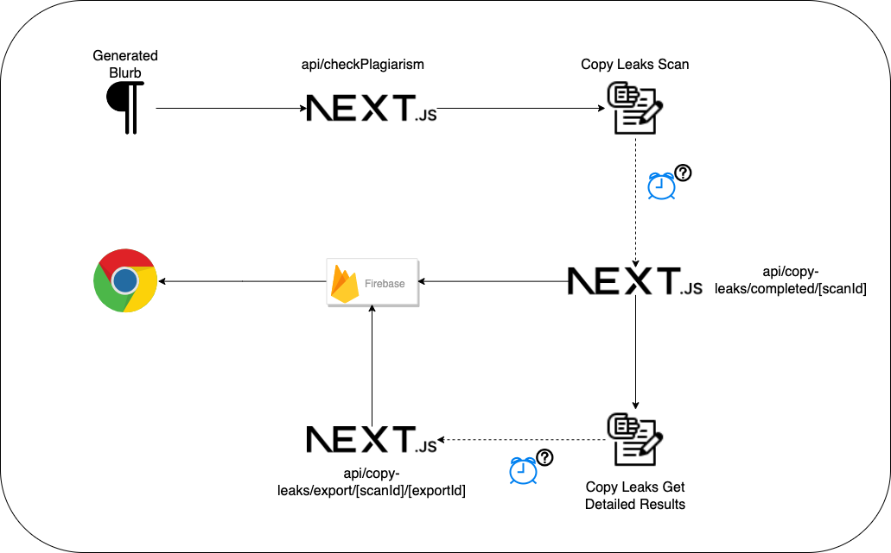
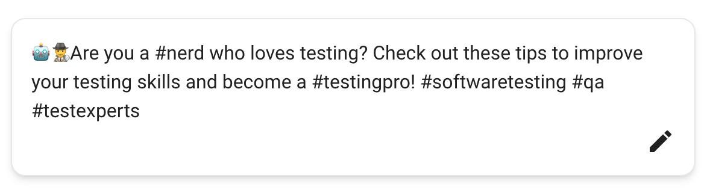
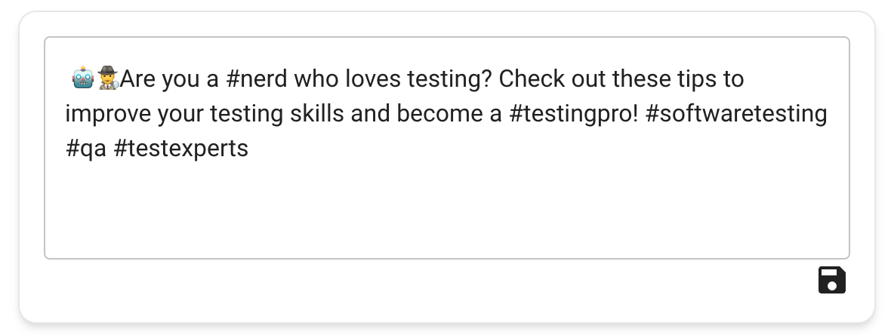
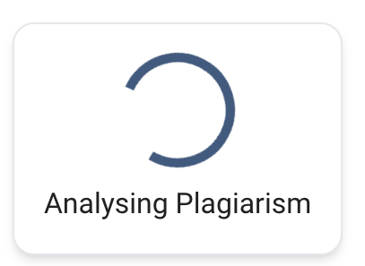
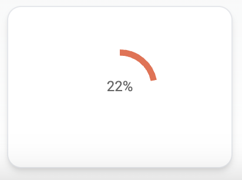
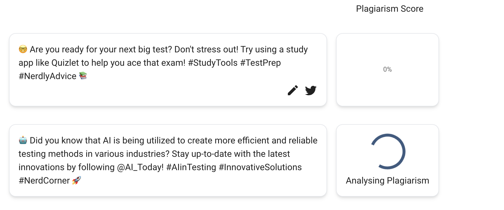
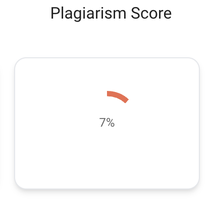
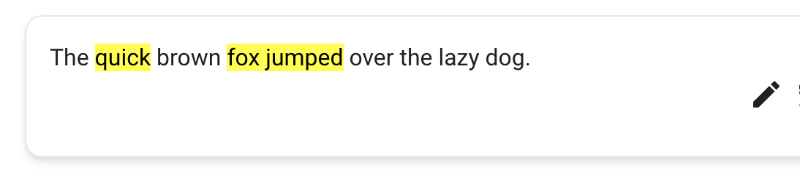

# Module 3

In this module we learn how to check your blurb for plagiarism using the CopyLeaks API, Firebase Realtime Database and Webhooks.
<br>



The flow for a plagiarism check is as follows:

1. The frontend calls our Next.js `plagiarismCheck` API with some text to be checked. A `scanId` is returned. We then listen to Firebase for any changes on the node `scan/[scanId]`.
2. This text is then passed to the CopyLeaks `scan` API - Copyleaks is an online plagiarism detection tool.
3. Once CopyLeaks has finished scanning our text for plagiarism it sends high level details of the results to our `pages/api/copy-leaks/completed/[scanId]` Webhook. **It can take up to two minutes before we receive these results.**
4. When we receive the high level results in our `pages/api/copy-leaks/completed/[scanId]` Webhook. We do the following:

- We write the scan results to Firebase. Once our listener, mentioned in step 1, gets notified of this change we then calculate the plagiarism score based off this data.
- We find the source within the results which has the highest amount of suspected plagiarism and pass it to the CopyLeaks `exportResults` API.

5. The CopyLeaks `exportResults` API gives us further information about a particular source such as which words in our text it thinks were plagiarised. Once CopyLeaks has finished exporting the results of a source it sends the low level details of the results to our `pages/api/copy-leaks/export/[scanId]/[resultId]` Webhook. **It can take up to a minute before we receive these results**.
6. When we receive the results in our `pages/api/copy-leaks/export/[scanId]/[resultId]` Webhook. We do the following:

- We write the results to Firebase.
- Once our listener, mentioned in step 1, gets notified of this change we highlight which words in our blurb were plagiarised based off this data.

---

## Contents

3.1 Plagiarism UI
<br>
3.2 Verify UI with Dummy Values
<br>
3.3 Webhooks
<br>
3.4 Writing a Firebase Library
<br>
3.5 Validate Webhooks in the UI Using Firebase
<br>
3.6 Next.js Plagiarism Check API
<br>
3.7 Hookup API to Frontend

---

## 3.1 Plagiarism UI

Firstly, let's start creating the UI to show our plagiarism results.

### Tasks

Ensure you running `pnpm dev` before solving the next tasks.

**3.1.1 Track When Blurb Has Finished Generating**

We can only start editing a blurb once all the blurbs have finished generating.

1. Create a boolean state variable in `index.tsx` that tracks if all the blurbs have finished generating. Then pass this value as a `prop` to the `Blurb` component.

<details>
  <summary>Solution</summary>

```ts
...
const [blurbsFinishedGenerating, setBlurbsFinishedGenerating] = useState<boolean>(false);
...

  async function generateBlurb() {
  setBlurbsFinishedGenerating(false);
  ...
  while(!done){
    ...
  }

  setBlurbsFinishedGenerating(true);

  ...
  <Blurb
  key={index}
  generatingBlurb={generatingPost}
  blurbsFinishedGenerating={blurbsFinishedGenerating}
  ></Blurb>
  ...
```

</details>
<br>

In React, `useEffect` is a built-in hook that allows you to perform side effects in functional components. The `useEffect` hook takes two arguments: a function and an optional array of dependencies. The function passed as the first argument will be executed after the component renders, and it will run again if any of the dependencies change.

2. Create a new state variable called `blurb` which is set to the completed generated blurb. You should use `useEffect` for this while having `blurbsFinishedGenerating` as a dependency.

```ts
...
const [blurb, setBlurb] = useState<string>();
...

  useEffect(() => {
    if (blurbsFinishedGenerating) {
      setBlurb(generatingBlurb);
    }
  }, [blurbsFinishedGenerating]);
```

</details>
<br>

**3.1.2 Editing a Blurb**

1. Enable your blurb to be reworded and saved. Use `mui/icons-material` package for this.
   **Important once the blurb is rephrased we will NOT recheck the blurb for plagiarism**
   It should look like this:




<details>
  <summary>Solution</summary>

1. Install `mui/icons-material` using `pnpm i @mui/icons-material`
2. In `Blurb.tsx` add a boolean state variable named `enableEditor` and set the default value to false.
3. Add a string state variable named `rephrasedBlurb`.
4. Add a conditional in the blurb HTML based on `enableEditor`.
   1. If `enableEditor` is true
      1. Change the blurb box to be a `TextField`.
      2. Add a close button using muis `CloseIcon` and set the `onClick` property to change `enableEditor` to be false.
      3. Add a save button using muis `SaveIcon` and set the `onClick` property to change the blurb to be the `repharasedBlurb` and to change the `enableEditor` property to be false.
   2. If `enableEditor` is false
      1. Add an edit button using muis `EditIcon` and set the `onClick` property to change `enableEditor` to be true.

Your `Blurb.tsx` should look something like this:

```ts
return (
  <>
    <Card>
      <CardContent>
        {blurbsFinishedGenerating ? (
          generatingBlurb
        ) : enableEditor ? (
          <>
            <TextField
              className="bg-white rounded-xl"
              defaultValue={blurb}
              onChange={(event) => {
                setRephrasedBlurb(event.target.value);
              }}
              multiline
              style={{ width: "100%" }}
            ></TextField>
          </>
        ) : (
          blurb
        )}
      </CardContent>
      <CardActions>
        {blurbsFinishedGenerating && enableEditor ? (
          <Stack direction="row-reverse" spacing="0.5em">
            <Box>
              <CloseIcon
                className="cursor-pointer"
                onClick={() => {
                  setEnableEditor(false);
                }}
              ></CloseIcon>
            </Box>
            <Box>
              <SaveIcon
                className="cursor-pointer"
                onClick={() => {
                  setBlurb(rephrasedBlurb);
                  setEnableEditor(false);
                }}
              ></SaveIcon>
            </Box>
          </Stack>
        ) : (
          <Stack direction="row-reverse" spacing="0.5em">
            <Box>
              <EditIcon
                className="cursor-pointer"
                onClick={() => setEnableEditor(true)}
              />
            </Box>
          </Stack>
        )}
      </CardActions>
    </Card>
  </>
);
```

</details>
<br>

**3.1.3 Plagiarism Progress Bar**

Copy and paste the `components` folder found in `module3/content/components` into the root of your project. The `CenterBox` component will help you center your plagiarism score component.

1. Write a component called `Loading.tsx` in the `Plagiarism` folder in components. You will need need muis `CircularProgress` component for this

It should look like this:



<details>
  <summary>Solution</summary>

1. In a folder named `Plagiarism` in the `components` folder, add a file named `Loading.tsx`
   1. This will return muis `CircularProgress` component.
   2. Underneath this component add the text `Analysing Plagiarism`

```ts
import { Box, CircularProgress } from "@mui/material";

export function Loading() {
  return (
    <>
      <Box
        sx={{
          height: "100%",
          display: "flex",
          justifyContent: "center",
          flexDirection: "column",
        }}
      >
        <CircularProgress size="4em" />
      </Box>
      <Box paddingTop="0.5em" textAlign="center">
        Analysing Plagiarism
      </Box>
    </>
  );
}
```

</details>
<br>

2. In a folder named `Plagiarism` in the `components` folder, add a file named `Score.tsx`
   1. This will function will take a `value` number variable and a `label` string variable as parameters.
   2. Use muis `CircularProgress` component with the `determinate` variant with the `value` property set to `value`.
   3. Underneath this component add the text in `label`

It should look like this:



<details>
  <summary>Solution</summary>

```ts
import * as React from "react";

import CircularProgress, {
  CircularProgressProps,
} from "@mui/material/CircularProgress";

import Box from "@mui/material/Box";
import { CenterBox } from "../CenterBox";
import Typography from "@mui/material/Typography";

export function Score(
  props: CircularProgressProps & { value: number; label: string }
) {
  return (
    <Box
      sx={{
        display: "flex",
        flexDirection: "column",
        alignItems: "center",
      }}
    >
      <Box width="100%" display="inline-flex" position="relative">
        <CircularProgress
          variant="determinate"
          value={props.value}
          color="secondary"
          size="4em"
        />
        <CenterBox>
          <Typography variant="caption" component="div" color="text.secondary">
            {props.label}
          </Typography>
        </CenterBox>
      </Box>
    </Box>
  );
}
```

</details>
<br>

3. In a folder named `Plagiarism` in the `components` folder, add a file named `Plagiarism.tsx`

   1. This will function will take a `loading` boolean variable and a `score` number variable as parameters.
   2. If `loading` is true we will show our `Loading` component.
   3. If `loading` is false we will show our `Score` component.

<details>
  <summary>Solution</summary>

```ts
import { Box } from "@mui/material";
import { Loading } from "./Loading";
import { Score } from "./Score";

interface Props {
  loading: boolean;
  score?: number;
}

export function Plagiarism({ loading, score }: Props) {
  return (
    <Box
      sx={{
        display: "flex",
        height: "100%",
        alignItems: "center",
        flexDirection: "column",
        justifyContent: "center",
      }}
    >
      {loading ? (
        <Loading />
      ) : (
        typeof score === "number" && (
          <Score value={score} label={`${Math.round(score)}%`} />
        )
      )}
    </Box>
  );
}
```

</details>
<br>

4. In `Blurb.tsx`
   1. Add a boolean state variable named `plagiarismLoading` with the default value of false.
   2. Add a number state variable named `plagiarisedScore` with the default value of 0.
   3. At the bottom of the HTML `Stack` add the `Plagiarism` component with the `loading` property having the value `plagiarismLoading` and the `score` property having the value `plagiarisedScore`.

Your `Blurb.tsx` return statement should look like this:

<details>
  <summary>Solution</summary>

```ts
...
      <Button onClick={generateBlurb}>Generate Blurb</Button>
      {generatedBlurb && (
        <>
        ...
        </>
      )}
      <Stack
        alignItems="center"
        justifyContent="center"
        width="15em"
        className="bg-white rounded-xl shadow-md p-4 border"
      >
        <Plagiarism loading={plagiarismLoading} score={plagiarisedScore} />
      </Stack>
    </Stack>
  </>
);
```

</details>
<br>

**3.1.4 Add Plagiarism Score Column Name**

1. Add the heading `Plagiarism Score` above the plagiarism score components.

<details>
  <summary>Solution</summary>
  
```ts
{
  generatingPosts && (
    <>
      <Stack direction="row-reverse" width="100%">
        <Typography width="12em" textAlign="center">
          Plagiarism Score
        </Typography>
      </Stack>
      {generatingPosts
        .substring(generatingPosts.indexOf("1.") + 3)
        .split(/2\.|3\./)
        .map((generatingPost, index) => {
          return (
            <Blurb
              key={index}
              generatingBlurb={generatingPost}
              blurbsFinishedGenerating={blurbsFinishedGenerating}
            ></Blurb>
          );
        })}
    </>
  );
}
```

</details>
<br>

Your finally component should look like this:



---

## 3.2 Verify UI with Dummy Values

Before we write our APIs, lets use some dummy objects to validate our changes. This will allow us to avoid using time consuming APIs and provide us with quicker feedback. Lets assume for now that our database already has results. We will work backwards starting from step 6 in our flow mentioned at the top of this page.
<br>

**3.2.1 Handle Scan Results**

Let's assume the `pages/api/copy-leaks/export/[scanId]/[resultId]` Webhook has completed and we have the dummy scan results object found in `module3/content/utils/dummy-data/dummyScanResults.json` in Firebase. Copy and paste the entire `module/utils` folder into the root of your project.

1. Write a function that uses the dummy results file to calculate the percentage of the blurb which was plagiarised. It should look like this:



<details>
  <summary>Solution</summary>

1. In `Blurb.tsx` create a function called `handleScan` which takes a `text` string variable as a parameter and a `scan` object parameter.
2. In `checkPlagiarism` set `plagiarismLoading` to be true.
3. In `checkPlagiarism` assign a variable called `scan` to have the value of our dummy object.
4. In `checkPlagiarism` call `handleScan` and set `plagiarismLoading` to be false.
5. Calculate the total number of words in our blurb by doing a `string.split()` on our blurb and finding the length of this array.
6. Get the total number of `matchedWords` from our scan.
7. Set the `plagiarisedScore` to be `(matchedWords/totalWords) * 100` .

```ts
import dummyScanResults from "@/utils/dummy-data/dummyScanResults.json";
...
  const checkPlagiarism = async (streamedBlurb: string) => {
    setPlagiarismLoading(true);
    const scan = dummyScanResults;
    handleScan(streamedBlurb, scan);
    setPlagiarismLoading(false);
  };
```

```ts
function handleScan(text: string, scan: any) {
  const totalBlurbWords = text.split(" ").length;
  const matchedWords = scan.matchedWords;
  setPlagiarisedScore((matchedWords / totalBlurbWords) * 100);
}
```

</details>
<br>

As this runs pretty quickly we don't actually get to see our loading spinner. Let's put a timeout for 5 seconds in our `checkPlagiarism` function to force our loading spinner to show. Your function should look like this:

```ts
const checkPlagiarism = async (streamedBlurb: string) => {
  setPlagiarismLoading(true);
  await new Promise((r) => setTimeout(r, 5000));
  const scan = dummyScanResults;
  handleScan(streamedBlurb, scan);
  setPlagiarismLoading(false);
};
```

Now that we tested that the loading spinner works. We can remove the timeout.

**3.2.2 Handle Detailed Results**

Lets extend your `handleScan` function to handle detailed results. Copy and paste this function into `Blurb.tsx`. This should highlight the text in the blurb which has been plagiarised.

```ts
function getHighlightedHTMLBlurb(
  text: string,
  characterStarts: number[],
  characterLengths: number[]
) {
  let characterStartsIndex = 0;
  let highlightedHTMLBlurb = "";
  for (let i = 0; i < text.length; i++) {
    if (i == characterStarts[characterStartsIndex]) {
      const segmentStart = characterStarts[characterStartsIndex];
      const segmentEnd =
        characterStarts[characterStartsIndex] +
        characterLengths[characterStartsIndex];

      highlightedHTMLBlurb += `<mark style="background:#FF9890">${text.substring(
        segmentStart,
        segmentEnd
      )}</mark>`;

      i = segmentEnd - 1;
      characterStartsIndex = characterStartsIndex + 1;
    } else {
      highlightedHTMLBlurb += text[i];
    }
  }
  return <Box dangerouslySetInnerHTML={{ __html: highlightedHTMLBlurb }}></Box>;
}
```

Here is an example of how you should interpret the results from Copy Leaks:
Given the blurb
And the `characterStarts` array for the blurb
And the `characterLengths` array for the blurb
Then highlight the words in the blurb that have been plagiarised

- `characterStarts` is an array of character indexes in the blurb
  which indicate the beginning of the plagiarised text. This
  has a 1-1 relationship with `characterLengths`
- `characterLengths` is an array of lengths after a `characterStarts`
  element for text that has been plagiarised

Example:

text = "The quick brown fox jumped over the lazy dog."
<br>
`characterStarts`: [4, 16]
<br>
`characterLengths`: [5, 10]

1.  characterStart = 4 & characterLength = 5
    <br>
    characterEnd = 4 + 5 = 9
    <br>
    plagiarisedText = text[4] + text[5] + text[6] + text[7] + text[8]
    <br>
    = "quick"

2.  characterStart = 16 & characterLength = 10
    <br>
    characterEnd = 16 + 10 = 26
    <br>
    plagiarisedText = text[16] + text[17] + text[18] + ... + text[25]
    <br>
    = "fox jumped"

More information on `characterStart` and `characterLength` under chars.starts and chars.lengths:
https://api.copyleaks.com/documentation/v3/webhooks/result

This is what is should look like:



1. Extend your `handleScan` function to use the `getHighlightedHTMLBlurb` function.

<details>
  <summary>Solution</summary>

1. Create a state variable called `highlightedHTMLBlurb` of type `JSX.Element`.
2. In the `handleScan` function set the `characterStarts` variable to be `scan.results.identical.source.chars.starts`
3. In the `handleScan` function set the `characterLengths` variable to be `scan.results.identical.source.chars.lengths`
4. Call the `getHighlightedHTMLBlurb` function with `blurb`, `characterStarts` and `characterLengths`.

```ts
function handleScan(text: string, scan: any) {
  const totalBlurbWords = text.split(" ").length;
  const matchedWords = scan.matchedWords;
  setPlagiarismScore((matchedWords / totalBlurbWords) * 100);
  const characterStarts = scan.results.identical.source.chars.starts;
  const characterLengths = scan.results.identical.source.chars.lengths;
  const highlightedHTMLBlurb = getHighlightedHTMLBlurb(
    text,
    characterStarts,
    characterLengths
  );
  setHighlightedHTMLBlurb(highlightedHTMLBlurb);
}
```

3. Change the `useEffect` hook to to set the `highlightedHTMLBlurb` to be the a HTML element with the finished Blurb as it's content

```ts
useEffect(() => {
  if (blurbsFinishedGenerating) {
    setBlurb(generatingBlurb);
    setHighlightedHTMLBlurb(<>{generatingBlurb}</>);
  }
}, [blurbsFinishedGenerating]);
```

4. Change the HTML to show the new `highlightedHTMLBlurb`.

   1. Change the save buttons `onClick` callback to also set `highlightedHTMLBlurb` to be the new rephrasedBlurb. A rephrased blurb is NOT rechecked for plagiarism so this text will never be highlighted.
   2. Show the `highlightedHTMLBlurb` instead of the `rephrasedBlurb` in the blurb box.

```ts
<CardContent>
  {!blurbsFinishedGenerating ? (
    generatingBlurb
  ) : enableEditor ? (
    <>
      <TextField
        className="bg-white rounded-xl"
        defaultValue={blurb}
        onChange={(event) => {
          setRephrasedBlurb(event.target.value);
        }}
        multiline
        style={{ width: "100%" }}
      ></TextField>
      <Stack direction="row-reverse" spacing="0.5em">
        <Box>
          <CloseIcon
            className="cursor-pointer"
            onClick={() => {
              setEnableEditor(false);
            }}
          ></CloseIcon>
        </Box>
        <Box>
          <SaveIcon
            className="cursor-pointer"
            onClick={() => {
              setBlurb(rephrasedBlurb);
              setHighlightedHTMLBlurb(<>{rephrasedBlurb}</>);
              setEnableEditor(false);
            }}
          ></SaveIcon>
        </Box>
      </Stack>
    </>
  ) : (
    <>
      {highlightedHTMLBlurb}
      <Stack direction="row-reverse" spacing="0.5em">
        <Box>
          <EditIcon
            className="cursor-pointer"
            onClick={() => setEnableEditor(true)}
          />
        </Box>
      </Stack>
    </>
  )}
</CardContent>
```

</details>
<br>

**3.2.3 Check for Plagiarism**

We should only check for plagiarism once the blurbs have finished generating.

1. Amend the `useEffect` function to check call our `checkPlagiarism` function once our blurbs have finished generating.

<details>
  <summary>Solution</summary>

```ts
useEffect(() => {
  if (blurbsFinishedGenerating) {
    checkPlagiarism(generatingBlurb);
    setBlurb(generatingBlurb);
    setHighlightedHTMLBlurb(<>{generatingBlurb}</>);
  }
}, [blurbsFinishedGenerating]);
```

</details>
<br>

---

## 3.3 Webhooks

In order to receive the results of scans and exports from the Copy Leaks servers we need to create two webhooks. These webhooks will then write their data to our Firebase database. Before we setup our Webhooks, let's create a Firebase Realtime Database.

Firebase Realtime Database is a cloud-hosted NoSQL database provided by Google as part of the Firebase platform. It is a real-time, scalable database solution designed to store and synchronize data across multiple clients in real-time. This database will only be used to store the results from a CopyLeaks plagiarism check and then notify the front end that results have been returned.

This link will be helpful when completing this section - https://firebase.google.com/docs/database/web/start

---

### 3.3.1 Creating a Firebase Realtime Database

1. Go to https://console.firebase.google.com/
2. Sign in with a Google account
3. Click on `Create Project`
4. Enter a project name - this can be anything like `latency-blurb-workshop`
5. Accept the terms and conditions and click `Continue`
6. Do not enable Google Analytics and click `Create Project`
7. Click continue
8. On the left navigation bar, select the `Build` accordion and the click on `Realtime Database`
9. Click `Create Database`
10. Select `Singapore` as your database location. Click `Next`
11. Select `Start in Test mode`. Click `Enable`
12. Copy your database URL which will be something like `https://latency-blurb-workshop-default-rtdb.asia-southeast1.firebasedatabase.app/` depending on what you named your project in step 4.
13. Add your database URL to .env.local for the variable `NEXT_PUBLIC_FIREBASE_REALTIME_DATABASE_URL`

**Important all API calls must use `fetch` and not `axios`**

### Tasks

**3.3.2.1 Create an Export Webhook**

As we are working backwards through the workflow lets first write the `export` Webhook, mentioned in step 5. This is webhook called by CopyLeaks with the detailed results of a source from a plagiarism scan.

In Next.js, dynamic routes allow you to create pages with dynamic content based on the values in the URL. It enables you to generate static pages with dynamic paths and parameters, allowing you to build dynamic and interactive web applications.

Dynamic routes are defined by placing the file inside the pages directory in Next.js with square brackets [] in the filename. For example, if you create a file named [id].js inside the pages directory, it will match any route that has a dynamic segment in the URL. The dynamic segment will be accessible as a parameter in the page component.

In our case we want a dynamic route for the `scanId` and the `exportId` as this will be constantly changing for each scan that we do.

1. Create a dynamic route Edge function named `[exportId].ts` in `pages/api/copy-leaks/export/[scanId]/` which receives the results of an export and returns a response with `{message: "Result exported successfully"}`. This should also write the results to the database using the Firebase PUT API under the node `scans/<scanId>/results.json`. We only need the object in `text.comparison`. Instead of writing the actual results to the database.
   <br>
   More information:

- Copy Leaks: https://api.copyleaks.com/documentation/v3/webhooks/result.
- Firebase: https://firebase.google.com/docs/database/rest/save-data#section-put

<details>
  <summary>Solution</summary>

1. Create a file named `[exportId].ts` in `pages/api/copy-leaks/export/[scanId]/`.
2. Create a handler which takes a `req` parameter.
3. Get the scan ID from the `req.url.searchParams` parameter.
4. Write the result details to the database.
5. Return the `{message: "Result exported successfully"}` as a response.

```ts
import { NextRequest, NextResponse } from "next/server";

export const config = {
  runtime: "edge",
  regions: ["syd1"],
};

export default async function handler(req: NextRequest) {
  const params = new URL(req.url).searchParams;
  const scanId = params.get("scanId");
  const body = await req.json();

  try {
    await fetch(
      `${process.env.NEXT_PUBLIC_FIREBASE_REALTIME_DATABASE_URL}/scans/${scanId}/results.json`,
      {
        method: "PUT",
        body: JSON.stringify(body.text.comparison),
      }
    );
  } catch (e) {
    console.error("Error writing to Firebase database", e);
    throw e;
  }

  return NextResponse.json({ message: "Result exported successfully" });
}
```

</details>
<br>

**3.3.2.2 Create a Scan Webhook**

Now lets write the `scan` Webhook, mentioned in step 4.

1. Create aa dynamic route Edge function named `[scanId].ts` in `pages/api/copy-leaks/completed` which receives the results of a scan and returns a response with `{message: "Scan Completed"}`. This should also write the scan to the database using the Firebase PUT API under the node `scans/<scanId>.json`. Instead of writing the actual results to the database.

More information:

- Copy Leaks: https://api.copyleaks.com/documentation/v3/webhooks/completed.
- Firebase: https://firebase.google.com/docs/database/rest/save-data#section-put

<details>
  <summary>Solution</summary>

1. Create a file named `[scanId].ts` in `pages/api/copy-leaks/completed`.
2. Create a handler which takes a `req` parameter.
3. Get the scan results from the `req` parameter.
4. Get the scan Id from the scan results.
5. Write the scan to the database.
6. Return the `{message: "Scan Completed"}` as a response.
7. Push your code to main to deploy your Webhook.

```ts
import { NextRequest, NextResponse } from "next/server";

export const config = {
  runtime: "edge",
  regions: ["syd1"],
};

export default async function handler(req: NextRequest) {
  const body = await req.json();
  const scanId = body.scannedDocument.scanId;
  try {
    await fetch(
      `${process.env.NEXT_PUBLIC_FIREBASE_REALTIME_DATABASE_URL}/scans/${scanId}.json`,
      {
        method: "PUT",
        body: JSON.stringify({ body.scannedDocument}),
      }
    );
  } catch (e) {
    console.error("Error writing to Firebase Database", e);
    throw e;
  }

  return NextResponse.json({ message: "Scan complete" });
}
```

</details>
<br>

**3.3.2.3 Get the Highest Matched Words**

A scan may return multiple sources where it thinks the plagiarised text comes from. For the amount of text we are scanning it is safe to assume we should get a response back from Copy Leaks in 2 minutes. Looking at the scan results we receive from Copy Leaks, there is a lot of information we are not interested in for this workshop: https://api.copyleaks.com/documentation/v3/webhooks/completed#1-example. We are only interested in the result in `results.internet` which has the highest amount of `matchedWords`. That is to say we are only interested in the source which has the most amount of plagiarised text.

Copy and paste this function into your `scan` webhook. This function will return the source with the highest number of `matchedWords`..

```ts
type SourceResult = {
  resultId: string;
  matchedWords: number;
};

function getHighestSourceResult(
  completedScanWebhookResponse: any
): SourceResult {
  let matchedWords = 0;
  let resultId = "";
  if (completedScanWebhookResponse.results.internet.length > 0) {
    const sortedResults = completedScanWebhookResponse.results.internet.sort(
      (a: SourceResult, b: SourceResult) => a.matchedWords - b.matchedWords
    );
    const highestResult = sortedResults[0];
    resultId = highestResult.id;
    matchedWords = highestResult.matchedWords;
  }

  return {
    resultId,
    matchedWords: matchedWords,
  };
}
```

1. Edit your webhook to find the scan result which has the highest number of `matchedWords`. Instead of writing the entire scan to firebase, write only the number of `matchedWords`.

<details>
  <summary>Solution</summary>

1. Set the initial number of `matchedWords` to be 0. If no plagiarism is found there will be 0 `matchedWords`.
2. Sort the `results.internet` array in descending order based on `matchedWords`.
3. Get the ID and the number of matched words for the top result.
4. Return the `{message: "Scan Completed"}` as a response.

```ts
export default async function handler(req: NextRequest) {
  const body = dummyCompletedScanWebhookResponse;
  const scanId = body.scannedDocument.scanId;
  const matchedWords = getHighestMatchedWords(body);

  try {
    await fetch(
      `${process.env.NEXT_PUBLIC_FIREBASE_REALTIME_DATABASE_URL}/scans/${scanId}.json`,
      {
        method: "PUT",
        body: JSON.stringify({ matchedWords: matchedWords }),
      }
    );
  } catch (e) {
    console.error("Error writing to Firebase Database", e);
    throw e;
  }

  return NextResponse.json({ message: "Scan complete" });
}
```

</details>
<br>

---

## 3.4 Writing a Firebase Library

Before we can test our Webhooks in the frontend we first need to write a Firebase class. The Firebase class that we will be writing will be a wrapper around the Firebase SDK which we will use in the frontend to listen to events on the database.

### Tasks

**3.4.1 Installing the Firebase SDK Package**

1. Install the Firebase SDK Package - https://www.npmjs.com/package/firebase

<details>
  <summary>Solution</summary>

1. In your terminal run `pnpm i firebase`

</details>
<br>

**3.4.2 Creating an Empty FirebaseWrapper Class**

1. Create an empty class library named `FirebaseWrapper.tsx` in a sub-folder named `firebase`.

<details>
  <summary>Solution</summary>

1. In your `lib` folder create a class named `FirebaseWrapper.tsx` in a sub-folder named `firebase`.
2. In `FirebaseWrapper.tsx` add the following code:

```ts
export class FirebaseWrapper {}
```

</details>
<br>

**3.4.3 Write a Get Database Function**

1. Write a function called `getInstance` that will return an instance of your database - https://firebase.google.com/docs/database/web/start#add_the_js_sdk_and_initialize

<details>
  <summary>Solution</summary>

1. Create a `public` function called `getInstance`.
2. Add a `firebaseConfig` object which has `databaseURL` as a key and a value of your Firebase URL. In 3.3.1.13, we set the environment variable `NEXT_PUBLIC_FIREBASE_REALTIME_DATABASE_URL` to be our database URL. With this in mind the value of our Firebase URL will be `${process.env.NEXT_PUBLIC_FIREBASE_REALTIME_DATABASE_URL}`
3. Initialise the Firebase app instance with `const app = initializeApp(firebaseConfig)`
4. Get the database instance from the app instance.

```ts
const database = getDatabase(app);
return database;
```

Your `FirebaseWrapper.tsx` should now look like this:

```ts
export class FirebaseWrapper {
  public getInstance(): Database {
    const firebaseConfig = {
      databaseURL: `${process.env.NEXT_PUBLIC_FIREBASE_REALTIME_DATABASE_URL}`,
    };
    const app = initializeApp(firebaseConfig);
    const database = getDatabase(app);

    return database;
  }
}
```

</details>
<br>

**Convert the FirebaseWrapper Class to Return a Singleton Instance**

Imagine a scenario where we have to get 3 items from our database in the frontend. With our current implementation, every time we initialise the class in the frontend we would have to initialise the connection to the database as well. This would mean that we would have to initialise a connection to our database 3 times, this can be time-consuming and is considered bad practice.

**Singletons**

A singleton is a design pattern that restricts the number of instantiations of a class to one for the lifetime of the application. In this case every time we call the instance we would always be returned the same instance which in turn means we would not have any overheads in establishing multiple connections to the database. More information: https://refactoring.guru/design-patterns/singleton

Copy and paste the code below to make your database a Singleton instance.

```ts
this.database = getDatabase(app);
return this.database;
```

Your `FirebaseWrapper.tsx` should now look like this:

```ts
import { Database, getDatabase, ref } from "firebase/database";

import { initializeApp } from "firebase/app";

export class FirebaseWrapper {
  private database?: Database;

  private getInstance(): Database {
    if (!this.database) {
      const firebaseConfig = {
        databaseURL: `${process.env.NEXT_PUBLIC_FIREBASE_REALTIME_DATABASE_URL}`,
      };
      const app = initializeApp(firebaseConfig);
      this.database = getDatabase(app);
    }

    return this.database;
  }
}
```

We should also write a helper function to get a reference to the node in the database with a particular scan ID. Copy and paste the function below.

Your `FirebaseWrapper.tsx` should now look like this:

```ts
export class FirebaseWrapper {
  private database?: Database;

  public getScanReference(scanId: string) {
    return ref(this.getInstance(), `scans/${scanId}`);
  }

...
}
```

---

## 3.5 Validate Webhooks in the UI Using Firebase

Now that our Webhooks can write data to Firebase we can test their responses in the frontend. To do this we can manually call the Webhooks from the frontend, while we use Firebase to listen for events on the `scans/[scanId]` node.
Ensure to use this `scanId` `f1d0db14-c4d2-487d-9615-5a1b8ef6f4c2` and this `7e514eabb3`

### Tasks

**3.5.1 Manually call the Scan and Export Webook**

The dummy data for this task can be found in `module3/utils/dummy-data/dummyCompletedExportResultsWebhookResponse.json` and `module3/utils/dummy-data/dummyCompletedScanWebhookResponse.json`.

1. In `Blurb.tsx` in `checkPlagiarism` make a manual API call to the `scan` webhook with a fake request body.
2. In `Blurb.tsx` in `checkPlagiarism` make a manual API call to the `export` webhook with a fake request body.

<details>
  <summary>Solution</summary>

```ts
  import dummyCompletedExportResultsWebhookResponse from "@/utils/dummy-data/dummyCompletedExportResultsWebhookResponse.json";
  import dummyCompletedScanWebhookResponse from "@/utils/dummy-data/dummyCompletedScanWebhookResponse.json";

useEffect(() => {
...

  const checkPlagiarism = async (streamedBlurb: string) => {
    setPlagiarismLoading(true);
    const scan = dummyScanResults;
    const completedScanWebhookResponse = await fetch(
      "/api/copy-leaks/completed/f1d0db14-c4d2-487d-9615-5a1b8ef6f4c2",
      {
        method: "POST",
        headers: {
          "Content-Type": "application/json",
        },
        body: JSON.stringify({
          text: dummyCompletedScanWebhookResponse,
        }),
      }
    );

    const completedExportResultsWebhookResponse = await fetch(
      "/api/copy-leaks/export/f1d0db14-c4d2-487d-9615-5a1b8ef6f4c2/7e514eabb3",
      {
        method: "POST",
        headers: {
          "Content-Type": "application/json",
        },
        body: JSON.stringify({
          text: dummyCompletedExportResultsWebhookResponse,
        }),
      }
    );
    handleScan(streamedBlurb, scan);
    setPlagiarismLoading(false);
  };
```

</details>
<br>

**3.5.2 Listening to Firebase Events**

Now that we can send scan results and export results to the database via Webhook lets listen to Firebase for when the results are returned.

1. Using the Firebase SDK listen for scan results on a specific node based on `scanId`. Use Firebases `onValue` function. Remember to use the `scanId` `f1d0db14-c4d2-487d-9615-5a1b8ef6f4c2`.
   <br>
   More information: https://firebase.google.com/docs/database/web/read-and-write#read_data

<details>
  <summary>Solution</summary>

1. After we get our `scanId` from our `scan` API but before we set the `plagiarismLoading` to be false in `useEffect`, instantiate a `FirebaseWrapper`.
2. Get a `scanRef` by calling `FirebaseWrapper.getScanReference(scanId)`.
3. Use Firebases `onValue` function to listen for events on our `scanRef`.
4. If the `scanRecord` does not exist, do nothing. This means that CopyLeaks has not returned the results as yet.
5. Remove the `setPlagiarismLoading(false)` line. This will now be handled by the `handleScan` function.
6. Call our `handleScan` function with the `scanRecord.val()` as a parameter.

```ts
useEffect(() => {
  const checkPlagiarism = async (streamedBlurb: string) => {
    setPlagiarismLoading(true);

    const scanId = "f1d0db14-c4d2-487d-9615-5a1b8ef6f4c2";
    const completedScanWebhookResponse = await fetch(
      "/api/copy-leaks/completed/f1d0db14-c4d2-487d-9615-5a1b8ef6f4c2",
      {
        method: "POST",
        headers: {
          "Content-Type": "application/json",
        },
        body: JSON.stringify({
          text: dummyCompletedScanWebhookResponse,
        }),
      }
    );

    const completedExportResultsWebhookResponse = await fetch(
      "/api/copy-leaks/export/f1d0db14-c4d2-487d-9615-5a1b8ef6f4c2/7e514eabb3",
      {
        method: "POST",
        headers: {
          "Content-Type": "application/json",
        },
        body: JSON.stringify({
          text: dummyCompletedExportResultsWebhookResponse,
        }),
      }
    );

    const firebase = new FirebaseWrapper();
    const scanRef = firebase.getScanReference(scanId);
    onValue(scanRef, async (scanRecord: any) => {
      // Only continue if a <scanId> node is present in Firebase
      if (scanRecord.exists()) {
        const scan = scanRecord.val();
        handleScan(streamedBlurb, scan);
      }
    });
  };
```

7. Change our `handleScan` function to take a scan as a parameter.
   1. Remove the `setPlagiarismLoading(false)` line from the `checkPlagiarism` function.
   2. Add a check to see og there are 0 `matchedWords` if this is the case none of our blurb will be highlighted.
   3. Add a check above the assignment of the `characterStarts` variable to check if `scan.results` exists. This is because a `scan` will return before `scan.results` is in the database as we are only writing the `scan.results` node once we have the `scan` information and the time between these calls will be close to 40 seconds. See our `api/copy-leaks/completed/[scanId].ts` for more information.
   4. Add the `setPlagiarismLoading(false)` line after we recieve the results from Firebase.

```ts
function handleScan(text: string, scan) {
  const totalBlurbWords = text.split(" ").length;
  const matchedWords = scan.matchedWords;
  setPlagiarismScore((matchedWords / totalBlurbWords) * 100);
  if (matchedWords == 0) {
    setPlagiarismLoading(false);
  } else if (scan.results) {
    const characterStarts = scan.results.identical.source.chars.starts;
    const characterLengths = scan.results.identical.source.chars.lengths;
    const highlightedHTMLBlurb = getHighlightedHTMLBlurb(
      text,
      characterStarts,
      characterLengths
    );
    setHighlightedHTMLBlurb(highlightedHTMLBlurb);
    setPlagiarismLoading(false);
  }
}
```

</details>
<br>

---

## 3.6 Next.js Plagiarism Check API

In order to call the the CopyLeaks scan function we need to create an API. Before we write our API we first need to write a library that can call the CopyLeaks API. Copyleaks is an online plagiarism detection and content verification platform. It utilizes advanced algorithms and artificial intelligence (AI) technology to compare submitted content against a vast database of sources, including web pages, academic journals, publications, and more.

**It is important to note that as this is a free account we are only entitled to 25 plagiarism checks. If you run out of credits you will have to go through this process again but with a different email address. Credits will only be used when you use the deployed version of your app. Credits will not be used in local development, in local development CopyLeaks will run in sandbox mode, this means that a valid response will be returned but the response results will contain mocked data.**

### 3.6.1 Setting Up a Copy Leaks API

1. Go to https://copyleaks.com/
2. Click on `Login`
3. Click on `Sign Up`
4. Enter an email and password
5. Verify your email address - check your junk folder for the code
6. Enter in your details - this can be anything◊
7. Go to https://api.copyleaks.com/dashboard/
8. In the `API Access Credentials` Tile click on `Generate` for one of the keys
9. Copy this key into the `COPY_LEAKS_API_KEY` variable in `.env.local`
10. Add the email address you used to sign up with to `COPY_LEAKS_EMAIL`variable in`.env.local`

### 3.6.2 Writing a CopyLeaks Library

The CopyLeaks class that we will be writing will be a wrapper around the CopyLeaks SDK which we will use in the frontend of our application. We will only need to use 3 CopyLeaks APIs in this course:

1. Login - https://api.copyleaks.com/documentation/v3/account/login
2. Scan - https://api.copyleaks.com/documentation/v3/scans/submit/file
3. Export Results - https://api.copyleaks.com/documentation/v3/downloads/export

**Important all API calls must use `fetch` and not `axios`**

### Tasks

**3.6.3.1 Installing the CopyLeaks SDK Package**

1. Install the CopyLeaks SDK Package - https://www.npmjs.com/package/plagiarism-checker.
2. Install the `uuid` package to generate Ids - https://www.npmjs.com/package/uuid
3. Install the `types/uuid` package - https://www.npmjs.com/package/@types/uuid

<details>
  <summary>Solution</summary>

1. In your terminal run `pnpm i plagiarism-checker`
2. In your terminal run `pnpm i uuid`
3. In your terminal run `pnpm i --save-dev @types/uuid`

</details>
<br>

Copy and paste the folder found in `module3/content/lib` into the root of your project.

**3.6.3.2 Create a Plagiarism Check API**

1. Create an Edge function named `plagiarismCheck.ts` which calls our `CopyLeaksWrapper.scan` function the the text to be scanned. More information: https://vercel.com/docs/concepts/functions/edge-functions.
2. Deploy your API

**Important: When CopyLeaks.scan is called, this request returns an HTTP Code of 201. This function does not return the results directly, instead when the results are ready, CopyLeaks sends a response to one of our APIs via webhook. The webhook will only be called on a deployed public website. ie. Having localhost as the webhook domain will not work as localhost will not have a publicly accessible IP.**

<details>
  <summary>Solution</summary>

1. Create a file named `plagiarismCheck.ts` in `pages/api`.
2. Create a handler which takes a `req` parameter.
3. Instantiate the `CopyLeaksWrapper`.
4. Get the text to be scanned from the `req` parameter.
5. Call the `CopyLeaks.scan` method with the text.
6. Return the `scanId`.
7. Push your code to main to deploy your API.

```ts
import { CopyLeaksWrapper } from "@/lib/copy-leaks/copyLeaksWrapper";
import { NextRequest, NextResponse } from "next/server";

export const config = {
  runtime: "edge",
  regions: ["syd1"],
};

type ScanRequest = {
  text: string;
};

export default async function handler(req: NextRequest) {
  const copyLeaks = new CopyLeaksWrapper();
  const body = (await req.json()) as ScanRequest;
  const scanId = await copyLeaks.scan(body.text);
  return NextResponse.json({ scanId });
}
```

</details>
<br>

**3.6.2.3 Calling the Export Function from the Scan Webhook**

Once the `scan` Webhook receives a result we want to immediately call the CopyLeaksWrapper function `getDetailedResults` in order to get more details on the source with the highest number of matched words. This is step 4.2 in our workflow.

**Important: When CopyLeaks.getDetailedResults is called, this request returns an HTTP Code of 201. This function does not return the results directly, instead when the results are ready, CopyLeaks sends a response to one of our APIs via webhook. The webhook will only be called on a deployed public website. ie. Having localhost as the webhook domain will not work as localhost will not have a publicly accessible IP.**

1. Edit your `scan` webhook to call the `CopyLeaksWrapper.getDetailedResults` function with the `scanId` and `resultId` on the source with the highest number of matched words.

<details>
  <summary>Solution</summary>

4. Instantiate the `CopyLeaksWrapper`.
5. Call `CopyLeaksWrapper.getDetailedResults` with the `scanId` and `resultId`.

```ts
export default async function handler(req: NextRequest) {
  const body = dummyCompletedScanWebhookResponse;
  const scanId = body.scannedDocument.scanId;
  if (matchedWords != 0) {
    const copyLeaks = new CopyLeaksWrapper();
    await copyLeaks.getDetailedResults(scanId, resultId);
  }
  try {
    await fetch(
      `${process.env.NEXT_PUBLIC_FIREBASE_REALTIME_DATABASE_URL}/scans/${scanId}.json`,
      {
        method: "PUT",
        body: JSON.stringify({ matchedWords: matchedWords }),
      }
    );
  } catch (e) {
    console.error("Error writing to Firebase Database", e);
    throw e;
  }

  return NextResponse.json({ message: "Scan complete" });
}
```

</details>
<br>

---

## 3.7 Hookup API to Frontend

Now that we know the UI works with dummy values, lets use real world values. **Important: From this point on your application must be deployed in order for the plagiarism check to work**

**3.7.1 Calling the Scan API**

1. In `Blurb.tsx`, remove the direct calls to the `scan` and the `export` Webhooks.
2. the `Write a `useEfffect`function calls our`scan` API.

<details>
  <summary>Solution</summary>

1. Remove the direct calls to the `scan` and the `export` Webhooks.
2. Append the `useEfffect` function to watch for when a `blurb` is set and `finishedStreaming` is true. When this is true call the `checkPlagiarism` function.
3. Create a `checkPlagiarism` function which takes the `text` as a parameter.
   1. Set `plagiarismLoading` to be true.
   2. Call our `scan` API with our text. Get the `scanId` from this response.
   3. Set `plagiarismLoading` to be false.

```ts
type ScanResponse = {
  scanId: string;
};
...
  const checkPlagiarism = async (streamedBlurb: string) => {
    setPlagiarismLoading(true);

    // Send blurb to be scanned for plagiarism
    const scanResponse = await fetch("/api/plagiarismCheck", {
      method: "POST",
      headers: {
        "Content-Type": "application/json",
      },
      body: JSON.stringify({
        text: streamedBlurb,
      }),
    });

    const scanId = ((await scanResponse.json()) as ScanResponse).scanId;
    const firebase = new FirebaseWrapper();
    const scanRef = firebase.getScanReference(scanId);
    onValue(scanRef, async (scanRecord: any) => {
      // Only continue if a <scanId> node is present in Firebase
      if (scanRecord.exists()) {
        const scan = scanRecord.val();
        handleScan(streamedBlurb, scan);
      }
    });
  };
```

</details>
<br>

Finally, push your code to deploy your app and test your blurbs with real plagiarism check. **Important: Once we deploy, we are no longer in sandbox mode, the response from CopyLeaks may take up to two minutes so you may see the loading spinner for a long time.**

If a response hasn't come back after two minutes, check https://api.copyleaks.com/dashboard to see if you have enough credits. Remember we are checking 3 blurbs at once so we will use 3 credits every time we generate blurbs. If you run out of credits you will have to create a new Copy Leaks account with a different email address as outlined in step 3.6.1

---
