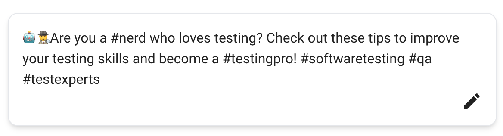
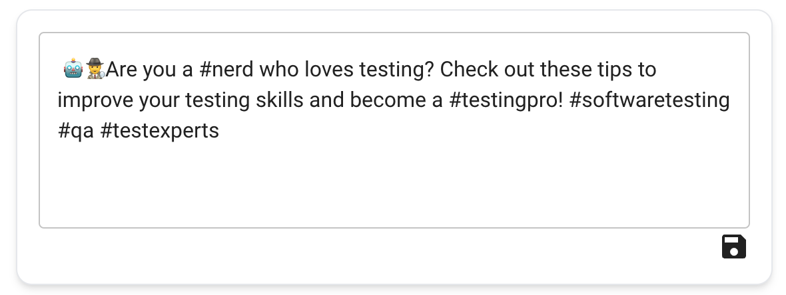

# Module 3

In this module we learn how to check your blurb for plagiarism using a CopyLeaks and Firebase Realtime Database.

---

## Contents

3.1. Firebase Realtime Database
<br>
3.2. Copy Leaks API
<br>
3.3 NextJS API
<br>
3.4 Webhooks
<br>
3.5 Frontend

---

## 3.1 Firebase Realtime Database

Firebase Realtime Database is a cloud-hosted NoSQL database provided by Google as part of the Firebase platform. It is a real-time, scalable database solution designed to store and synchronize data across multiple clients in real-time. This database will only be used to store the results from a CopyLeaks plagiarism check and then notify the front end that results have been returned.

This link will be helpful when completing this section - https://firebase.google.com/docs/database/web/start

---

### 3.1.1 Creating a Firebase Realtime Database

1. Go to https://console.firebase.google.com/
2. Sign in with a Google account
3. Click on `Create Project`
4. Enter a project name - this can be anything like `latency-blurb-workshop`
5. Accept the terms and conditions and click `Continue`
6. Do not enable Google Analytics and click `Create Project`
7. Click continue
8. On the left navigation bar, select the `Build` accordion and the click on `Realtime Database`
9. Click `Create Database`
10. Select `Singapore` as your database location. Click `Next`
11. Select `Start in Test mode`. Click `Enable`
12. Copy your database URL which will be something like `https://latency-blurb-workshop-default-rtdb.asia-southeast1.firebasedatabase.app/` depending on what you named your project in step 4.
13. Add your database URL to .env.local for the variable `NEXT_PUBLIC_FIREBASE_REALTIME_DATABASE_URL`

---

### 3.1.2 Writing a Firebase Library

The Firebase class that we will be writing will be a wrapper around the Firebase SDK which we will use in the frontend of our application.

---

### Tasks

**3.1.2.1 Installing the Firebase SDK Package**

1. Install the Firebase SDK Package - https://www.npmjs.com/package/firebase

<details>
  <summary>Solution</summary>

1. In your terminal run `pnpm i firebase`

</details>
<br>

**3.1.2.2 Creating an Empty FirebaseWrapper Class**

1. Create an empty class library named `FirebaseWrapper.tsx` in a sub-folder named `firebase`.

<details>
  <summary>Solution</summary>

1. In your `lib` folder create a class named `FirebaseWrapper.tsx` in a sub-folder named `firebase`.
2. In `FirebaseWrapper.tsx` add the following code:

```ts
export class FirebaseWrapper {}
```

</details>
<br>

**3.1.2.2 Write a Get Database Function**

1. Write a function called `getInstance` that will return an instance of your database - https://firebase.google.com/docs/database/web/start#add_the_js_sdk_and_initialize

<details>
  <summary>Solution</summary>

1. Create a `public` function called `getInstance`.
2. Add a `firebaseConfig` object which has `databaseURL` as a key and a value of your Firebase URL. In 3.1.1.13, we set the environment variable `NEXT_PUBLIC_FIREBASE_REALTIME_DATABASE_URL` to be our database URL. With this in mind the value of our Firebase URL will be `${process.env.NEXT_PUBLIC_FIREBASE_REALTIME_DATABASE_URL}`
3. Initialise the Firebase app instance with `const app = initializeApp(firebaseConfig)`
4. Get the database instance from the app instance

```ts
const database = getDatabase(app);
return database;
```

Your `FirebaseWrapper.tsx` should now look like this:

```ts
export class FirebaseWrapper {
  public getInstance(): Database {
    const firebaseConfig = {
      databaseURL: `${process.env.NEXT_PUBLIC_FIREBASE_REALTIME_DATABASE_URL}`,
    };
    const app = initializeApp(firebaseConfig);
    const database = getDatabase(app);

    return database;
  }
}
```

</details>
<br>

**3.1.2.3 Convert the FirebaseWrapper Class to Return a Singleton Instance**

Imagine a scenario where we have to get 3 items from our database in the frontend. With our current implementation, every time we initialise the class in the frontend we would have to initialise the connection to the database as well. This would mean that we would have to initialise a connection to our database 3 times, this can be time-consuming and is considered bad practice.

**Singletons**

A singleton is a design pattern that restricts the number of instantiations of a class to one for the lifetime of the application. In this case every time we call the instance we would always be returned the same instance which in turn means we would not have any overheads in establishing multiple connections to the database. More information: https://refactoring.guru/design-patterns/singleton

1. Convert the `GetInstance` function to return a Singleton instance

<details>
  <summary>Solution</summary>

1. Create a private class variable called `database` of type `Database`
2. In the `getInstance` method, assign the `getDatabase(app)` method call to this class variable. Then return the class variable

```ts
this.database = getDatabase(app);
return this.database;
```

Your `FirebaseWrapper.tsx` should now look like this:

```ts
export class FirebaseWrapper {
  private database?: Database;

  private getInstance(): Database {
    if (!this.database) {
      const firebaseConfig = {
        databaseURL: `${process.env.NEXT_PUBLIC_FIREBASE_REALTIME_DATABASE_URL}`,
      };
      const app = initializeApp(firebaseConfig);
      this.database = getDatabase(app);
    }

    return this.database;
  }
}
```

</details>
<br>

**3.1.2.4 Write a Get Scan Reference Function**

This function will be used to get reference to the node in the database with a particular scan ID.

1. Write a function called the `getScanReference` which takes an ID as a parameter and returns a database reference.

<details>
  <summary>Solution</summary>

1. Create a public function called `getScanReference` which takes a string parameter called `getScanReference`
2. Add a variable named `reference` with the value `ref(this.getInstance(), `scans/${scanId}`);`
3. Return the `reference` variable.

```ts
this.database = getDatabase(app);
return this.database;
```

Your `FirebaseWrapper.tsx` should now look like this:

```ts
export class FirebaseWrapper {
  private database?: Database;

  public getScanReference(scanId: string) {
    return ref(this.getInstance(), `scans/${scanId}`);
  }

  private getInstance(): Database {
    if (!this.database) {
      const firebaseConfig = {
        databaseURL: `${process.env.NEXT_PUBLIC_FIREBASE_REALTIME_DATABASE_URL}`,
      };
      const app = initializeApp(firebaseConfig);
      this.database = getDatabase(app);
    }

    return this.database;
  }
}
```

</details>
<br>

---

## 3.2 Copy Leaks

Copyleaks is an online plagiarism detection and content verification platform. It utilizes advanced algorithms and artificial intelligence (AI) technology to compare submitted content against a vast database of sources, including web pages, academic journals, publications, and more.

**It is important to note that as this is a free account we are only entitled to 25 plagiarism checks. If you run out of credits you will have to go through this process again but with a different email address.**

### 3.2.1 Setting Up a Copy Leaks API

1. Go to https://copyleaks.com/
2. Click on `Login`
3. Click on `Sign Up`
4. Enter an email and password
5. Verify your email address - check your junk folder for the code
6. Enter in your details - this can be anything◊
7. Go to https://api.copyleaks.com/dashboard/
8. In the `API Access Credentials` Tile click on `Generate` for one of the keys
9. Copy this key into the `COPY_LEAKS_API_KEY` variable in `.env.local`
10. Add the email address you used to sign up with to `COPY_LEAKS_EMAIL`variable in`.env.local`

### 3.2.2 Writing a CopyLeaks Library

The CopyLeaks class that we will be writing will be a wrapper around the CopyLeaks SDK which we will use in the frontend of our application. We will only need to use 3 CopyLeaks functions in this course:

1. Login - https://api.copyleaks.com/documentation/v3/account/login
2. Scan - https://api.copyleaks.com/documentation/v3/scans/submit/file
3. Export Results - https://api.copyleaks.com/documentation/v3/downloads/export

## **Important all API calls must use `fetch` and not `axios`**

### Tasks

**3.2.2.1 Installing the CopyLeaks SDK Package**

1. Install the CopyLeaks SDK Package - https://www.npmjs.com/package/plagiarism-checker

<details>
  <summary>Solution</summary>

1. In your terminal run `pnpm i plagiarism-checker`

</details>
<br>

**3.2.2.2 Creating an Empty CopyLeaksWrapper Class**

1. Create an empty class library named `CopyLeaksWrapper.tsx` in a sub-folder named `copy-leaks`.

<details>
  <summary>Solution</summary>

1. In your `lib` folder create a class named `CopyLeaksWrapper.tsx` in a sub-folder named `copy-leaks`.
2. In `CopyLeaksWrapper.tsx` add the following code:

```ts
export class CopyLeaksWrapper {}
```

</details>
<br>

**3.2.2.3 Writing a CopyLeaks Login Function**

In order to use the CopyLeaks API. We need to append every request with an access token. To get the access token, we first need to login. More information: https://api.copyleaks.com/documentation/v3/account/login

1. Write a function that will return an access token.

<details>
  <summary>Solution</summary>

1. Create a private function called `login`.
2. Make a `POST` api request to `https://id.copyleaks.com/v3/account/login/api` with your `COPY_LEAKS_EMAIL` and `COPY_LEAKS_API_KEY`
3. Return the result

```ts
export class CopyLeaksWrapper {
  private async login(): Promise<CopyleaksAuthToken> {
    if (!process.env.COPY_LEAKS_EMAIL) {
      throw new Error("COPY_LEAKS_EMAIL environment variable not set");
    }
    if (!process.env.COPY_LEAKS_API_KEY) {
      throw new Error("COPY_LEAKS_API_KEY environment variable not set");
    }

    const response = await fetch(
      "https://id.copyleaks.com/v3/account/login/api",
      {
        headers: { "Content-type": "application/json" },
        method: "POST",
        body: JSON.stringify({
          email: process.env.COPY_LEAKS_EMAIL,
          key: process.env.COPY_LEAKS_API_KEY,
        }),
      }
    );
    const result = (await response.json()) as CopyleaksAuthToken;
    return result;
  }
}
```

</details>
<br>

**3.2.2.4 Writing a CopyLeaks Refresh Token Function**

An access token expires 48 hours after you receive it, this means that we can use the same token for multiple requests.

1. Write a function which will call the `login` function if the token is not set or the token has expired.

<details>
  <summary>Solution</summary>

1. Create a private function called `getAccessToken`.
2. Create a private class variable called `accessToken`.
3. Create a private class variable called `copyleaks`. In the constructor assign this variable to be an instance of the CopyLeaks SDK.
4. Check if the access token is set - if it is not set, call the `login` function and return the access token.
5. If it is set, check if the access token is valid using the CopyLeaks SDK function `verifyToken`. If the token is valid, return the token.
6. If the token is invalid, request a new token.

```ts
export class CopyLeaksWrapper {
  private async login(): Promise<CopyleaksAuthToken> {
    if (!process.env.COPY_LEAKS_EMAIL) {
      throw new Error("COPY_LEAKS_EMAIL environment variable not set");
    }
    if (!process.env.COPY_LEAKS_API_KEY) {
      throw new Error("COPY_LEAKS_API_KEY environment variable not set");
    }

    const response = await fetch(
      "https://id.copyleaks.com/v3/account/login/api",
      {
        headers: { "Content-type": "application/json" },
        method: "POST",
        body: JSON.stringify({
          email: process.env.COPY_LEAKS_EMAIL,
          key: process.env.COPY_LEAKS_API_KEY,
        }),
      }
    );
    const result = (await response.json()) as CopyleaksAuthToken;
    return result;
  }

  private async getAccessToken(): Promise<CopyleaksAuthToken> {
    try {
      if (!this.accessToken) throw new Error("Access token not set");
      this.copyleaks.verifyAuthToken(this.accessToken);
    } catch (error) {
      console.log("Requesting new access token...");
      const newAccessToken = await this.login();
      this.accessToken = newAccessToken;
    } finally {
      if (!this.accessToken) throw new Error("Access token not set");
      return this.accessToken;
    }
  }
}
```

</details>
<br>

**3.2.2.5 Writing a Scan Function**

The scan function will send text to be scanned by CopyLeaks.
**Important: On a successful response, this request returns an HTTP Code of 201. This function does not return the results directly, instead when the results are ready, CopyLeaks sends a response to one of our APIs via webhook. The webhook will only be called on a deployed public website. ie. Having localhost as the webhook domain will not work as localhost will not have a publicly accessible IP. Every time this request is made with `sandbox` property set to `false` will use up one of you 25 credits.**

More information: https://api.copyleaks.com/documentation/v3/scans/submit/file

1. Write a function which will call the `https://api.copyleaks.com/v3/scans/submit/file/<scanId>` which takes the text to be scanned as a parameter and returns the scanId.

- In the request the filename property can be anything as we do not need this for the workshop - use "`{scanId}.txt`".
- In the request, the `webhooks.status` property is not being used by us as yet as we will set up webhooks in a later section, however CopyLeaks requires that you set it - use "`www.fakeURL.com/copy-leaks/{STATUS}/${scanId}`".
- Ensure that the `sandbox` property is set to `true`. This will be changed in a later step.

<details>
  <summary>Solution</summary>

1. Create a public function called `scan` with a string parameter called `text`.
2. Throw an error if text is less than 3 characters long.
3. Install the `uuid` package with `pnpm install uuid`. Create an ID for the scan using the `uuidv4` method.
4. Encode the text to `base64` using the `Buffer` class. The text has to be encoded in order for CopyLeaks to scan it.
5. Get an access token using the `getAccessToken` method we wrote in 3.2.2.4.
6. Create a POST request to call `https://api.copyleaks.com/v3/scans/submit/file/<scanId>` with the access token and the encoded text.
7. Return the scanId.

```ts
export class CopyLeaksWrapper {
  public async scan(text: string): Promise<string> {
    if (text.length < 2) throw new Error("Text too short to check");
    const scanId = uuidv4();
    const buffer = Buffer.from(text);
    const access_token = await this.getAccessToken();

    try {
      await fetch(`https://api.copyleaks.com/v3/scans/submit/file/${scanId}`, {
        headers: {
          "Content-type": "application/json",
          Authorization: `Bearer ${access_token.access_token}`,
        },
        method: "PUT",
        body: JSON.stringify({
          base64: buffer.toString("base64"),
          filename: `${scanId}.txt`,
          properties: {
            sandbox: true,
            filters: {
              minorChangesEnabled: false,
              relatedMeaningEnabled: false,
              safeSearch: true,
              sensitivityLevel: 1,
            },
            expiration: 1,
            webhooks: {
              status: `www.fakeURL.com/copy-leaks/{STATUS}/${scanId}`,
            },
          },
        }),
      });
    } catch (e) {
      console.error("Error submitting scan to CopyLeaks", e);
      throw e;
    }
    return scanId;
  }

  private async login(): Promise<CopyleaksAuthToken> {
    if (!process.env.COPY_LEAKS_EMAIL) {
      throw new Error("COPY_LEAKS_EMAIL environment variable not set");
    }
    if (!process.env.COPY_LEAKS_API_KEY) {
      throw new Error("COPY_LEAKS_API_KEY environment variable not set");
    }

    const response = await fetch(
      "https://id.copyleaks.com/v3/account/login/api",
      {
        headers: { "Content-type": "application/json" },
        method: "POST",
        body: JSON.stringify({
          email: process.env.COPY_LEAKS_EMAIL,
          key: process.env.COPY_LEAKS_API_KEY,
        }),
      }
    );
    const result = (await response.json()) as CopyleaksAuthToken;
    return result;
  }

  private async getAccessToken(): Promise<CopyleaksAuthToken> {
    try {
      if (!this.accessToken) throw new Error("Access token not set");
      this.copyleaks.verifyAuthToken(this.accessToken);
    } catch (error) {
      console.log("Requesting new access token...");
      const newAccessToken = await this.login();
      this.accessToken = newAccessToken;
    } finally {
      if (!this.accessToken) throw new Error("Access token not set");
      return this.accessToken;
    }
  }
}
```

</details>
<br>

**3.2.2.6 Writing an Export Function**

A scan may return multiple sources where it thinks the plagiarised text comes from. This function returns the details of a source and which lines within the source were plagiarised via a webhook.
**Important: On a successful response, this request returns an HTTP Code of 201. This function does not return the results directly, instead when the results are ready, CopyLeaks sends a response to one of our APIs via webhook. The webhook will only be called on a deployed public website. ie. Having localhost as the webhook domain will not work as localhost will not have a publicly accessible IP.**

More information: https://api.copyleaks.com/documentation/v3/downloads/export

1. Write a function which will call the `https://api.copyleaks.com/v3/export/${scanId}/${resultId}` which takes the scanId and resultId as parameters and returns an exportId.

- In the request, the `results[].endpoint` property is not being used by us as yet as we will set up webhooks in a later section, however CopyLeaks requires that you set it - use "`www.fakeURL.com/copy-leaks/export/${scanId}/${resultId}`".
- In the request, the `completionWebhook` property is not being used by us in this workshop, however CopyLeaks requires that you set it - use "`www.fakeURL.com/fake`".
- In the request, the `crawledVersion.endpoint` property is not being used by us in this workshop, however CopyLeaks requires that you set it - use "`www.fakeURL.com/fake`".
- In the request, the `crawledVersion.verb` property is not being used by us in this workshop, however CopyLeaks requires that you set it - use "`POST`".

<details>
  <summary>Solution</summary>

1. Create a public function called `exportResults` with two string parameters called `scanId` and `resultId`.
2. Create an ID for the export using the `uuidv4` method.
3. Get an access token using the `getAccessToken` method we wrote in 3.2.2.4.
4. Create a POST request to call `https://api.copyleaks.com/v3/export/${scanId}/${resultId}` with the access token and the encoded text.
5. Return the exportId.

```ts
export class CopyLeaksWrapper {
  public async exportResults(
    scanId: string,
    resultId: string
  ): Promise<string> {
    const exportId = uuidv4();
    const resultToExport: ExportResults = {
      id: resultId,
      verb: "POST",
      endpoint: `www.fakeURL.com/copy-leaks/export/${scanId}/${resultId}`,
    };
    const request: CopyleaksExportModel = {
      completionWebhook: `www.fakeURL.com/fake`,
      results: [resultToExport],
      crawledVersion: {
        endpoint: `www.fakeURL.com/fake`,
        verb: "POST",
      },
    };
    const access_token = await this.getAccessToken();

    try {
      await fetch(
        `https://api.copyleaks.com/v3/downloads/${scanId}/export/${exportId}`,
        {
          headers: {
            "Content-type": "application/json",
            Authorization: `Bearer ${access_token.access_token}`,
          },
          method: "POST",
          body: JSON.stringify(request),
        }
      );
    } catch (e) {
      console.error("Error exporting results from CopyLeaks", e);
      throw e;
    }
    return exportId;
  }

  public async scan(text: string): Promise<string> {
    if (text.length < 2) throw new Error("Text too short to check");
    const scanId = uuidv4();
    const buffer = Buffer.from(text);
    const access_token = await this.getAccessToken();

    try {
      await fetch(`https://api.copyleaks.com/v3/scans/submit/file/${scanId}`, {
        headers: {
          "Content-type": "application/json",
          Authorization: `Bearer ${access_token.access_token}`,
        },
        method: "PUT",
        body: JSON.stringify({
          base64: buffer.toString("base64"),
          filename: `${scanId}.txt`,
          properties: {
            sandbox: true,
            filters: {
              minorChangesEnabled: false,
              relatedMeaningEnabled: false,
              safeSearch: true,
              sensitivityLevel: 1,
            },
            expiration: 1,
            webhooks: {
              status: `www.fakeURL.com/copy-leaks/{STATUS}/${scanId}`,
            },
          },
        }),
      });
    } catch (e) {
      console.error("Error submitting scan to CopyLeaks", e);
      throw e;
    }
    return scanId;
  }

  private async login(): Promise<CopyleaksAuthToken> {
    if (!process.env.COPY_LEAKS_EMAIL) {
      throw new Error("COPY_LEAKS_EMAIL environment variable not set");
    }
    if (!process.env.COPY_LEAKS_API_KEY) {
      throw new Error("COPY_LEAKS_API_KEY environment variable not set");
    }

    const response = await fetch(
      "https://id.copyleaks.com/v3/account/login/api",
      {
        headers: { "Content-type": "application/json" },
        method: "POST",
        body: JSON.stringify({
          email: process.env.COPY_LEAKS_EMAIL,
          key: process.env.COPY_LEAKS_API_KEY,
        }),
      }
    );
    const result = (await response.json()) as CopyleaksAuthToken;
    return result;
  }

  private async getAccessToken(): Promise<CopyleaksAuthToken> {
    try {
      if (!this.accessToken) throw new Error("Access token not set");
      this.copyleaks.verifyAuthToken(this.accessToken);
    } catch (error) {
      console.log("Requesting new access token...");
      const newAccessToken = await this.login();
      this.accessToken = newAccessToken;
    } finally {
      if (!this.accessToken) throw new Error("Access token not set");
      return this.accessToken;
    }
  }
}
```

</details>
<br>

---

## 3.3 NextJS API

In order to call the the CopyLeaks scan function we need to create an API.

### Tasks

**3.3.1 Create a Plagiarism Check API**

1. Create an Edge function named `plagiarismCheck.ts` which calls our `CopyLeaksWrapper.scan` function the the text to be scanned. More information: https://vercel.com/docs/concepts/functions/edge-functions.
2. Deploy your API

<details>
  <summary>Solution</summary>

1. Create a file named `plagiarismCheck.ts` in `pages/api`.
2. Create a handler which takes a `req` parameter.
3. Instantiate the `CopyLeaksWrapper`.
4. Get the text to be scanned from the `req` parameter.
5. Call the `CopyLeaks.scan` method with the text.
6. Return the `scanId`.
7. Push your code to main to deploy your API.

```ts
import { NextRequest, NextResponse } from "next/server";

import { CopyLeaksWrapper } from "../../lib/copy-leaks/copyLeaksWrapper";

export const config = {
  runtime: "edge",
  regions: ["syd1"],
};

type ScanRequest = {
  text: string;
};

export default async function handler(req: NextRequest) {
  const copyLeaks = new CopyLeaksWrapper();
  const body = (await req.json()) as ScanRequest;
  const scanId = await copyLeaks.scan(body.text);
  return NextResponse.json({ scanId });
}
```

</details>
<br>

## 3.4 Webhooks

In order to receive the results of scans and exports from the Copy Leaks servers we need to create two webhooks. These webhooks will then write their data to our Firebase database.

**Important all API calls must use `fetch` and not `axios`**

### Tasks

**3.4.1 Create a Scan Webhook**

1. Create an Edge function named `[scanId].ts` in `pages/api/copy-leaks/completed` which receives the results of a scan and returns a response with `{message: "Scan Completed"}`. This should also write the scan to the database using the Firebase PUT API under the node `scans/<scanId>.json`. More information:
   1.1. Copy Leaks - https://api.copyleaks.com/documentation/v3/webhooks/completed.
   1.2. Firebase - https://firebase.google.com/docs/database/rest/save-data#section-put

<details>
  <summary>Solution</summary>

1. Create a file named `[scanId].ts` in `pages/api/copy-leaks/completed`.
2. Create a handler which takes a `req` parameter.
3. Get the scan results from the `req` parameter.
4. Get the scan Id from the scan results.
5. Write the scan to the database.
6. Return the `{message: "Scan Completed"}` as a response.
7. Push your code to main to deploy your Webhook.

```ts
import { NextRequest, NextResponse } from "next/server";

import { CopyLeaksWrapper } from "../../lib/copy-leaks/copyLeaksWrapper";

export const config = {
  runtime: "edge",
  regions: ["syd1"],
};

export default async function handler(req: NextRequest) {
  const body = (await req.json()) as CopyLeaksCompletedScan;
  const scanId = body.scannedDocument.scanId;
  try {
    await fetch(
      `${process.env.NEXT_PUBLIC_FIREBASE_REALTIME_DATABASE_URL}/scans/${scanId}.json`,
      {
        method: "PUT",
        body: JSON.stringify({ body.scannedDocument}),
      }
    );
  } catch (e) {
    console.error("Error writing to Firebase Database", e);
    throw e;
  }

  return NextResponse.json({ message: "Scan complete" });
```

</details>
<br>

**3.4.2 Call the Export Results Function from the Scan Webhook**

A scan may return multiple sources where it thinks the plagiarised text comes from. For the amount of text we are scanning it is safe to assume we should get a response back from Copy Leaks in 2 minutes. Looking at the scan results we receive from Copy Leaks, there is a lot of information we are not interested in for this workshop https://api.copyleaks.com/documentation/v3/webhooks/completed. We are only interested in the result in `results.internet` which has the highest amount of `matchedWords`. That is to say we are only interested in the source which has the most amount of plagiarised text.

1. Edit your webhook to find the scan result which has the highest number of `matchedWords`. Instead of writing the entire scan to firebase, write only the number of `matchedWords`.

```json
      {
        <scanId>:{
          "matchedWords": <numberOfMatchedWords>
        }
      }
```

2. Once this is found, call the `CopyLeaksWrapper.exportResults` function with the scanId and resultId of this source.
3. Push your code to main to deploy your webhook

<details>
  <summary>Solution</summary>

1. Set the initial number of `matchedWords` to be 0. If no plagiarism is found there will be 0 `matchedWords`.
2. Sort the `results.internet` array in descending order based on `matchedWords`.
3. Get the ID and the number of matched words for the top result.
4. Instantiate the `CopyLeaksWrapper`.
5. Call `CopyLeaksWrapper.exportResults` with the `scanId` and `resultId`.
6. Write only the `matchedWords` to the database.
7. Return the `{message: "Scan Completed"}` as a response.
8. Push your code to main to deploy your Webhook.

```ts
export default async function handler(req: NextRequest) {
  const body = (await req.json()) as CopyLeaksCompletedScan;
  const scanId = body.scannedDocument.scanId;
  let matchedWords = 0;
  if (body.results.internet) {
    const sortedResults = body.results.internet.sort(
      (a, b) => a.matchedWords - b.matchedWords
    );
    const highestResult = sortedResults[0];
    const resultId = highestResult.id;
    matchedWords = highestResult.matchedWords;
    const copyLeaks = new CopyLeaksWrapper();
    await copyLeaks.exportResults(scanId, resultId);
  }
  try {
    await fetch(
      `${process.env.NEXT_PUBLIC_FIREBASE_REALTIME_DATABASE_URL}/scans/${scanId}.json`,
      {
        method: "PUT",
        body: JSON.stringify({ matchedWords: matchedWords }),
      }
    );
  } catch (e) {
    console.error("Error writing to Firebase Database", e);
    throw e;
  }

  return NextResponse.json({ message: "Scan complete" });
}
```

</details>
<br>

**3.4.3 Create an Export Webhook**

This is webhook called by CopyLeaks with the detailed results of a source from a plagiarism scan.

1. Create an Edge function named `[exportId].ts` in `pages/api/copy-leaks/export/[scanId]/` which receives the results of an export and returns a response with `{message: "Result exported successfully"}`. This should also write the results to the database using the Firebase PUT API under the node `scans/<scanId>/results.json`. We only need the object in `text.comparison`. More information:
   1.1. Copy Leaks - https://api.copyleaks.com/documentation/v3/webhooks/result.
   1.2. Firebase - https://firebase.google.com/docs/database/rest/save-data#section-put

<details>
  <summary>Solution</summary>

1. Create a file named `[exportId].ts` in `pages/api/copy-leaks/export/[scanId]/`.

```json
      {
        <scanId>:{
          ...
          results:{
            identical:
            {
              source:{
                chars:{
                  start: <startsArray>,
                  lengths: <lengthsArray>
                }
              }
            }
          }
        }
      }
```

2. Create a handler which takes a `req` parameter.
3. Get the scan ID from the `req.url.searchParams` parameter.
4. Write the result details to the database.
5. Return the `{message: "Result exported successfully"}` as a response.

```ts
import { NextRequest, NextResponse } from "next/server";

export const config = {
  runtime: "edge",
  regions: ["syd1"],
};

export default async function handler(req: NextRequest) {
  const params = new URL(req.url).searchParams;
  const scanId = params.get("scanId");

  const body = await req.json();
  try {
    await fetch(
      `${process.env.NEXT_PUBLIC_FIREBASE_REALTIME_DATABASE_URL}/scans/${scanId}/results.json`,
      {
        method: "PUT",
        body: JSON.stringify(body.text.comparison),
      }
    );
  } catch (e) {
    console.error("Error writing to Firebase database", e);
    throw e;
  }

  return NextResponse.json({ message: "Result exported successfully" });
}
```

</details>
<br>

## 3.5 Frontend

### 3.5.1 Plagiarism UI

Finally, let's start creating the UI to show our plagiarism results.

### Tasks

Ensure you running `pnpm dev` before solving the next tasks.

**3.5.1.1 Editing a Blurb**

1. Enable your blurb to be reworded and saved. Use `mui/icons-material` package for this. It should look like this:




<details>
  <summary>Solution</summary>

1. Install `mui/icons-material` using `pnpm i @mui/icons-material`
2. In `GenerateBio.tsx` add a boolean state variable named `enableEditor` and set the default value to false.
3. Add a string state variable named `rephrasedBlurb`.
4. Add a conditional in the blurb HTML based on `enableEditor`.
   1. If `enableEditor` is true
      1. Change the blurb box to be a `TextField`.
      2. Add a close button using muis `CloseIcon` and set the `onClick` property to change `enableEditor` to be false.
      3. Add a save button using muis `SaveIcon` and set the `onClick` property to change the blurb to be the `repharasedBlurb` and to change the `enableEditor` property to be false.
   2. If `enableEditor` is false
      1. Add an edit button using muis `EditIcon` and set the `onClick` property to change `enableEditor` to be true.

Your `GenerateBio.tsx` return statement should look like this:

```ts
return (
  <>
    <Stack direction="row" spacing="1em" ref={blurbRef}>
      <Box width="100%" className="bg-white rounded-xl shadow-md p-4 border">
        {enableEditor ? (
          <>
            <TextField
              className="bg-white rounded-xl"
              defaultValue={blurb}
              onChange={(event) => {
                setRephrasedBlurb(event.target.value);
              }}
              multiline
              style={{ width: "100%" }}
            ></TextField>
            <Stack direction="row-reverse" spacing="0.5em">
              <Box>
                <CloseIcon
                  className="cursor-pointer"
                  onClick={() => {
                    setEnableEditor(false);
                  }}
                ></CloseIcon>
              </Box>
              <Box>
                <SaveIcon
                  className="cursor-pointer"
                  onClick={() => {
                    setBlurb(rephrasedBlurb);
                    setEnableEditor(false);
                  }}
                ></SaveIcon>
              </Box>
            </Stack>
          </>
        ) : (
          <>
            <Box>{highlightedHTMLBlurb}</Box>
            <Stack direction="row-reverse" spacing="0.5em">
              <Box>
                <EditIcon
                  className="cursor-pointer"
                  onClick={() => setEnableEditor(true)}
                />
              </Box>
            </Stack>
          </>
        )}
      </Box>
    </Stack>
  </>
);
```

</details>
<br>

**3.5.1.2 Plagiarism Progress Bar**

1. Add a section next to each blurb which holds a `CircularProgress` bar and a value as a percent. It should look like this:


<details>
  <summary>Solution</summary>

1. In a folder named `Plagiarism` in the `components` folder, add a file named `Loading.tsx`
   1. This will return muis `CircularProgress` component.
   2. Underneath this component add the text `Analysing Plagiarism`

```ts
import "react-circular-progressbar/dist/styles.css";

import { Box, CircularProgress } from "@mui/material";

export function Loading() {
  return (
    <>
      <Box
        sx={{
          height: "100%",
          display: "flex",
          justifyContent: "center",
          flexDirection: "column",
        }}
      >
        <CircularProgress size="4em" />
      </Box>
      <Box paddingTop="0.5em">Analysing Plagiarism</Box>
    </>
  );
}
```

2. In a folder named `Plagiarism` in the `components` folder, add a file named `Score.tsx`

   1. This will function will take a `value` number variable and a `label` string variable as parameters.
   2. Use muis `CircularProgress` component with the `determinate` variant with the `value` property set to `value`.
   3. Underneath this component add the text in `label`

```ts
import * as React from "react";

import CircularProgress, {
  CircularProgressProps,
} from "@mui/material/CircularProgress";

import Box from "@mui/material/Box";
import { CenterBox } from "../CenterBox";
import Typography from "@mui/material/Typography";

export function Score(
  props: CircularProgressProps & { value: number; label: string }
) {
  return (
    <Box
      sx={{
        display: "flex",
        flexDirection: "column",
        alignItems: "center",
      }}
    >
      <Box width="100%" display="inline-flex" position="relative">
        <CircularProgress
          variant="determinate"
          value={props.value}
          color="secondary"
          size="4em"
        />
        <CenterBox>
          <Typography variant="caption" component="div" color="text.secondary">
            {props.label}
          </Typography>
        </CenterBox>
      </Box>
    </Box>
  );
}
```

3. In a folder named `Plagiarism` in the `components` folder, add a file named `Plagiarism.tsx`

   1. This will function will take a `loading` boolean variable and a `score` number variable as parameters.
   2. If `loading` is true we will show our `Loading` component.
   3. If `loading` is false we will show our `Score` component.

```ts
import "react-circular-progressbar/dist/styles.css";

import { Box } from "@mui/material";
import { Loading } from "./Loading";
import { Score } from "./Score";

interface Props {
  loading: boolean;
  score?: number;
}

export function Plagiarism({ loading, score }: Props) {
  return (
    <Box
      sx={{
        display: "flex",
        height: "100%",
        alignItems: "center",
        flexDirection: "column",
        justifyContent: "center",
      }}
    >
      {loading ? (
        <Loading />
      ) : (
        typeof score === "number" && <Score value={score} label={`${score}%`} />
      )}
    </Box>
  );
}
```

4. In `GenerateBio.tsx`
   1. Add a boolean state variable named `plagiarismLoading` with the default value of false.
   2. Add a number state variable named `plagiarisedScore` with the default value of 0.
   3. At the bottom of the HTML `Stack` add the `Plagiarism` component with the `loading` property having the value `plagiarismLoading` and the `score` property having the value `plagiarisedScore`.

Your `GenerateBio.tsx` return statement should look like this:

```ts
return (
  <>
    <Stack direction="row" spacing="1em" ref={blurbRef}>
      <Box width="100%" className="bg-white rounded-xl shadow-md p-4 border">
        {enableEditor ? (
          <>
            <TextField
              className="bg-white rounded-xl"
              defaultValue={blurb}
              onChange={(event) => {
                setRephrasedBlurb(event.target.value);
              }}
              multiline
              style={{ width: "100%" }}
            ></TextField>
            <Stack direction="row-reverse" spacing="0.5em">
              <Box>
                <CloseIcon
                  className="cursor-pointer"
                  onClick={() => {
                    setEnableEditor(false);
                  }}
                ></CloseIcon>
              </Box>
              <Box>
                <SaveIcon
                  className="cursor-pointer"
                  onClick={() => {
                    setBlurb(rephrasedBlurb);
                    setEnableEditor(false);
                  }}
                ></SaveIcon>
              </Box>
            </Stack>
          </>
        ) : (
          <>
            <Box>{highlightedHTMLBlurb}</Box>
            {!plagiarismLoading && (
              <Stack direction="row-reverse" spacing="0.5em">
                <Box>
                  <EditIcon
                    className="cursor-pointer"
                    onClick={() => setEnableEditor(true)}
                  />
                </Box>
              </Stack>
            )}
          </>
        )}
      </Box>
      <Stack
        alignItems="center"
        justifyContent="center"
        width="15em"
        className="bg-white rounded-xl shadow-md p-4 border"
      >
        <Plagiarism loading={plagiarismLoading} score={plagiarisedScore} />
      </Stack>
    </Stack>
  </>
);
```

### 3.5.2 Verify UI with Dummy Values

**3.5.2.1 Handle Scan Results**

Using this dummy scan results object

```json
{
  "matchedWords": 7,
  "results": {
    "identical": {
      "source": {
        "chars": {
          "starts": [4, 16],
          "lengths": [5, 10]
        }
      }
    }
  }
}
```

do the following:

1. Install the Firebase SDK Package - https://www.npmjs.com/package/firebase

**3.5.2.2 Handle Detailed Results**

1. Install the Firebase SDK Package - https://www.npmjs.com/package/firebase

### 3.5.3 Hookup API

**3.5.3.1 Calling the Scan API**

**3.5.3.2 Listening to Firebase Events**

**3.5.3.3 Turning off the CopyLeaks Sandbox Mode**
